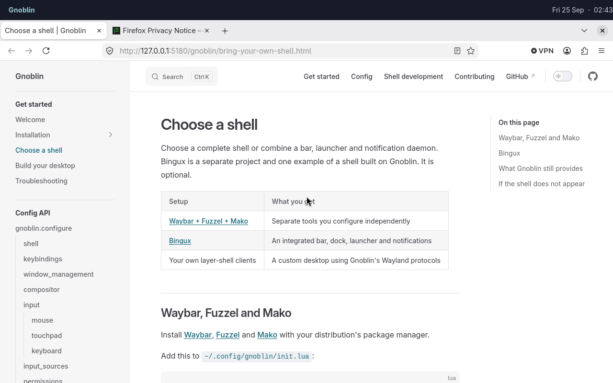
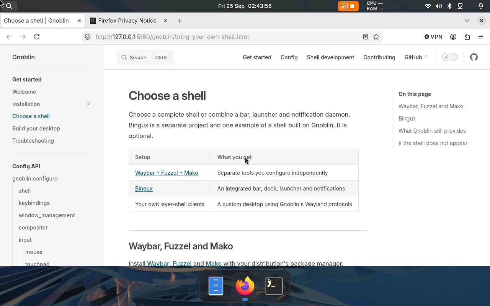

# Choose a shell

Choose a complete shell or combine a bar, launcher and notification daemon.
Bingux is a separate project and one example of a shell built on Gnoblin.
It is optional.

| Setup                                             | What you get                                        |
| ------------------------------------------------- | --------------------------------------------------- |
| [Waybar + Fuzzel + Mako](#waybar-fuzzel-and-mako) | Separate tools you configure independently          |
| [Bingux](#bingux)                                 | An integrated bar, dock, launcher and notifications |
| Your own layer-shell clients                      | A custom desktop using Gnoblin's Wayland protocols  |

## Waybar, Fuzzel and Mako

Install [Waybar](https://github.com/Alexays/Waybar),
[Fuzzel](https://codeberg.org/dnkl/fuzzel) and
[Mako](https://github.com/emersion/mako) with your distribution's package manager.

Add this to `~/.config/gnoblin/init.lua`:

```lua
gnoblin.configure {
    autostart = {
        bar = {command = {"waybar"}},
        notifications = {command = {"mako"}},
    },
    shortcuts = {
        launcher = {binding = "<Super>d", command = {"fuzzel"}},
    },
}
```

Configure Waybar's clock, tray and system modules as usual. Its Sway and
Hyprland modules need those compositors' own interfaces and do not work in Gnoblin.
Run one notification daemon; leave Gnoblin's native notifications disabled when
using Mako.

Configure each tool in its own files. Gnoblin's [autostart](/guides/autostart) and
[shortcuts](/guides/shortcuts) only control how you launch it.



_Firefox under Waybar in a fresh Gnoblin profile._

## Bingux

Bingux provides the desktop controls, notifications,
search and window switcher.



_Bingux is one separate shell project that uses Gnoblin. Files, Firefox and Foot are pinned in its dock._

Install the dependencies in the
[Bingux installation guide](https://github.com/kierandrewett/bingux/blob/main/docs/standalone.md),
then build and install it for your user:

```sh
git clone https://github.com/kierandrewett/bingux.git
cd bingux
make install-user
```

The installer builds the shell, enables its services and adds the Gnoblin
configuration include. Keep those includes when editing `init.lua`.

If you installed a Bingux package instead, enable its services:

```sh
systemctl --user daemon-reload
systemctl --user enable --now bingux.target
```

Do not also add Bingux to Gnoblin's autostart list.

## What Gnoblin still provides

Gnoblin keeps window management, locking and desktop services. GNOME extensions,
the Overview and native screenshot/OSD popups are not available in this session.

Native notifications and the keyboard-layout popup are optional.
See [session settings](/guides/session_settings#native-features).

## If the shell does not appear

Right-click the desktop and choose **Open Terminal**. If no layer surface appears
for eight seconds, Gnoblin also shows a recovery panel.

For Bingux, inspect its service:

```sh
systemctl --user status bingux.service
journalctl --user -b -u bingux.service
```

See [troubleshooting](troubleshooting.md#no-bar-dock-or-launcher).
To write your own shell, start with the [compositor bridge](compositor-bridge.md).
