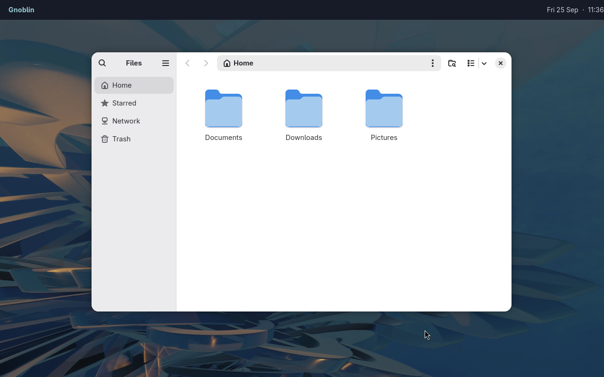
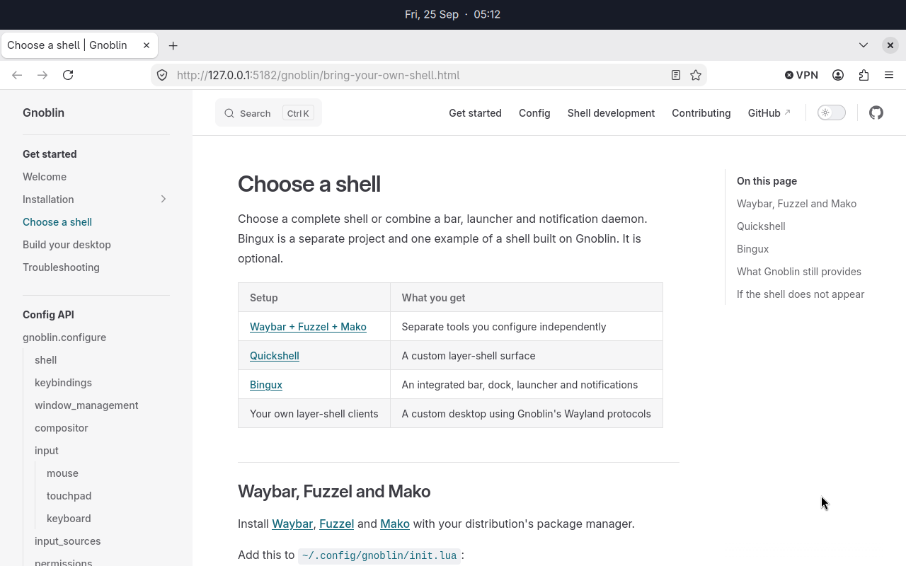

# Choose a shell

Choose a complete shell or combine a bar, launcher and notification daemon.
Bingux is a separate project and one example of a shell built on Gnoblin.
It is optional.

| Setup                                             | What you get                                        |
| ------------------------------------------------- | --------------------------------------------------- |
| [Waybar + Fuzzel + Mako](#waybar-fuzzel-and-mako) | Separate tools you configure independently          |
| [Quickshell](#quickshell)                         | A custom layer-shell surface                        |
| [Bingux](#bingux)                                 | An integrated bar, dock, launcher and notifications |
| Your own layer-shell clients                      | A custom desktop using Gnoblin's Wayland protocols  |

## Waybar, Fuzzel and Mako

Install [Waybar](https://github.com/Alexays/Waybar),
[Fuzzel](https://codeberg.org/dnkl/fuzzel) and
[Mako](https://github.com/emersion/mako) with your distribution's package manager.

Add this to `~/.config/gnoblin/init.lua`:

```lua
gnoblin.configure {
    autostart = {
        bar = {command = {"waybar"}},
        notifications = {command = {"mako"}},
    },
    shortcuts = {
        launcher = {binding = "<Super>d", command = {"fuzzel"}},
    },
}
```

Configure Waybar's clock, tray and system modules as usual. Its Sway and
Hyprland modules need those compositors' own interfaces and do not work in Gnoblin.
Run one notification daemon; leave Gnoblin's native notifications disabled when
using Mako.

Configure each tool in its own files. Gnoblin's [autostart](/guides/autostart) and
[shortcuts](/guides/shortcuts) only control how you launch it.


_Firefox is an ordinary client window; Waybar is a separate desktop client._



_A stock GNOME app running with Waybar and Mako as separate clients._

## Quickshell

[Quickshell](https://quickshell.org/) can host custom layer-shell surfaces.
This small `PanelWindow` example runs beside Firefox:

```qml
import Quickshell
import QtQuick

PanelWindow {
    anchors { top: true; left: true; right: true }
    implicitHeight: 42
    Text {
        anchors.centerIn: parent
        text: Qt.formatDateTime(new Date(), "ddd, dd MMM  ·  HH:mm")
    }
}
```



_The panel is a separate Quickshell process using Gnoblin's layer-shell support._

## Bingux

Bingux provides the desktop controls, notifications,
search and window switcher.


_Bingux is one separate shell project that uses Gnoblin. Files, Firefox and Foot are pinned in its dock._


_Files is a stock GNOME app; Bingux supplies the shell and dock._

Install the dependencies in the
[Bingux installation guide](https://github.com/kierandrewett/bingux/blob/main/docs/standalone.md),
then build and install it for your user:

```sh
git clone https://github.com/kierandrewett/bingux.git
cd bingux
make install-user
```

The installer builds the shell, enables its search and status helper services,
and adds the Gnoblin configuration include. Gnoblin Lua autostart launches the
shell and its layer-shell clients. Keep the configuration include when editing
`init.lua`.

If you installed a Bingux package instead, load its Gnoblin Lua module as
described in the Bingux installation guide. The package enables helper
services for Gnoblin sessions.

```sh
Do not add Bingux to Gnoblin's autostart list yourself; the package module
already defines startup for the shell and layer-shell clients.

## What Gnoblin still provides

Gnoblin provides window management, locking, desktop services, and a small
recovery panel for shell setup. GNOME extensions, the Overview, and native
screenshot/OSD popups are not available in this session.

Native notifications and the keyboard-layout popup are optional.
See [session settings](/guides/session_settings#native-features).

Gnoblin paints a solid black background behind desktop surfaces so areas
uncovered while windows move are repainted. This is not a wallpaper client.
Wallpaper layer surfaces sit above the black background; use an existing
client such as `swaybg` or the wallpaper client your shell already manages.
See [wallpapers](/guides/wallpapers).

## If the shell does not appear

After startup, Gnoblin waits briefly for shell activity. A mapped top or
overlay layer surface counts as shell activity; a bottom-layer wallpaper does
not.

If none appears while the session is unlocked, the recovery panel offers:

- Open the configuration path reported by `gnoblinctl config path`.
- Launch a terminal, if one is installed.
- Read this shell setup guide.

If no configuration exists, the panel creates the default Lua configuration at
that path. It does not replace an existing configuration.

Press Escape or choose Dismiss to hide the panel. It returns if shell
readiness changes and the shell later disappears. The panel stays hidden while
the session lock state is locked or unavailable.

If the panel does not appear, switch to another session or a text console and
inspect the shell's service and logs.

For Bingux helper services, inspect the optional target:

```sh
systemctl --user status bingux.target
journalctl --user -b -u bingux-searchd.service -u bingux-statusd.service
```

See [troubleshooting](troubleshooting.md#no-bar-dock-or-launcher).
To write your own shell, start with the [compositor bridge](compositor-bridge.md).
