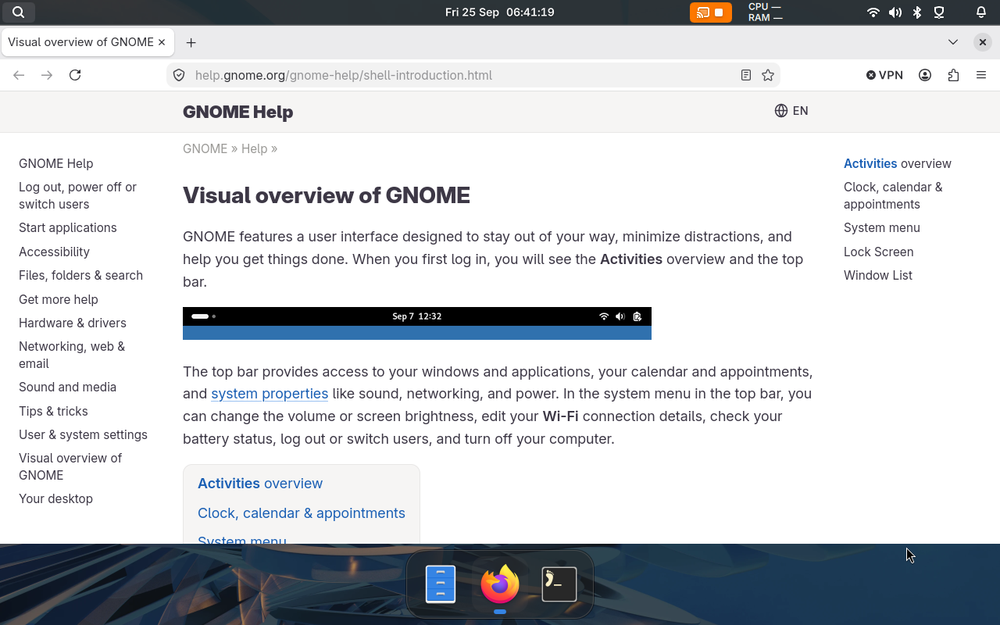

# Compositor bridge

Use this socket API to build a dock, launcher or window switcher. Set persistent
shortcuts in the [Lua config](/config/configure/shortcuts); use bridge bindings
for interactive UI while your client is connected. The bridge also lets your
shell read windows and request window actions.

For terminal commands and scripts, [gnoblinctl](gnoblinctl.md) handles the
connection for you.

Jump to the bridge's [API versions](#availability), [request format](#connect),
[operation reference](#operation-index), [common UI patterns](#example-watch-the-window-list),
or [connection limits](#limits-and-disconnects):

## Availability

The bridge is a built-in Gnoblin compositor service. It starts with the
standalone session and remains available across Lua configuration reloads.

The greeting lists the methods, events, and capabilities available in the
current build. `monitor.list` returns active connector names as IDs and the
current numeric `index` used by compatibility actions.

`layer.list` returns layer-shell surfaces with stable IDs, layer placement,
anchor, exclusive zone, keyboard-interactivity mode, geometry, and their
optional title and namespace. Each record includes `revision`; layer surfaces
do not have application IDs in the layer-shell protocol.

Send `{"op":"windows"}` to receive an initial snapshot and later snapshots as
windows change. Each snapshot has a monotonically increasing `revision` shared
by window, workspace, monitor, layer, and input-device state.

Send `{"op":"monitors"}` to receive the current monitor snapshot and later
snapshots when monitor state changes. A monitor snapshot has
`event: "monitors"`, a `monitors` array, and the current state `revision`.

Native monitor records include geometry, primary status, scale, index, and a
record revision. Only active logical monitors are listed. For cloned outputs,
the connector ID uses the first active connector alphabetically. An ID remains
usable while its monitor is listed; request another snapshot after outputs
change.

API version 1.1 subscriptions receive window, workspace, and monitor
lifecycle messages. `hello.events` lists available messages, and
`hello.capabilities` includes `window-lifecycle-events`,
`workspace-lifecycle-events`, and `monitor-lifecycle-events`.

### API version 1.2: layer surfaces

API 1.2 adds `layer.list` and the `layer-list` capability. The method accepts
exact-string filters for `monitor_id`, `namespace`, and `layer`. Its snapshots
share the state revision used by windows, workspaces, and monitors. The bridge
does not send layer lifecycle events.

Every supported client version serves `layer.list` from the shared Lua layer
snapshot while preserving the `{surfaces: [...]}` response.

Request API 1.2 or newer; older and versionless requests receive an
unsupported-version error:

```json
{ "op": "api", "id": "layers", "api_version": { "major": 1, "minor": 2 }, "method": "layer.list", "arguments": {} }
```

### API versions 1.3 and 1.4: input devices

API version 1.3 adds `input.devices` and the `input-device-list` capability.
The method takes an empty `arguments` object and returns `{devices, revision}`.
Each device record also has a `revision`.

API 1.3 returns a one-time snapshot.

At API 1.4, `input.devices` also subscribes the connection after returning its
initial snapshot. The greeting advertises `input-device-lifecycle-events` and
the two event names. The subscription lasts until the connection closes.

Each event has `revision`, `sequence`, and monotonic `time`. Added events
include `device`; removed events include `device_id` and the final `last`
record.

Device IDs are stable only for the current compositor session. Device records
do not expose device paths or `enabled`; Mutter has no safe enabled-state
getter. Input-device changes advance the shared state revision. Request API
version 1.4 to receive lifecycle events:

```json
{
    "op": "api",
    "id": "input-devices",
    "api_version": { "major": 1, "minor": 4 },
    "method": "input.devices",
    "arguments": {}
}
```

### API version 1.5: shortcut actions

API version 1.5 adds `shortcut.actions` to list built-in Mutter and window
manager shortcut actions. Its optional `group` argument
accepts `wm`, `mutter`, or `wayland`. Omit it to list all installed groups.

Each result record contains `id`, `group`, `key`, and `default_bindings`. A
record also contains `description` when the schema provides one. Bindings come
from installed GSettings schema defaults and do not reflect user-overridden
bindings. Request API version 1.5:

```json
{
    "op": "api",
    "id": "shortcut-actions",
    "api_version": { "major": 1, "minor": 5 },
    "method": "shortcut.actions",
    "arguments": { "group": "mutter" }
}
```

The API 1.5 socket method uses the same Lua read as `shortcuts.actions`.

API 1.42 adds the `permissions.list` Lua read. All supported client versions
use it and preserve the existing response shape. It requires the Lua supervisor.

API 1.43 adds the `permissions.check` Lua read. All supported client versions
use it and preserve the decision response shape. It requires the Lua supervisor.

API 1.44 adds the `permissions.policy` Lua read. All supported client versions
use it and preserve the policy and revision fields. It requires the Lua
supervisor.

API 1.45 adds `portals.grants` as a Lua-backed read. All supported clients get
the same JSON array and optional `kind` filter. The read requires the Lua
supervisor.

API 1.46 routes `input.devices`, `input.sources`, and `input.current_source`
through their shared Lua reads. Their response objects and revision fields stay
the same. Every supported client version uses these reads, which require the Lua
supervisor.

API 1.47 routes `privacy.state` through `gnoblin.privacy.state()`. The privacy
fields and revision stay the same. Every supported client version now reads
through Lua and requires the supervisor.

### API version 1.9: configured shortcuts

API version 1.9 adds `shortcut.list`. It takes no arguments and returns named
shortcuts configured for the native compositor. Each record contains `name`,
`binding`, `enabled`, `trigger`, and `revision`.

The socket method uses `gnoblin.shortcuts.list()`.

A record also contains a `command` argument array or an `action` identifier.
One binding is returned as a string; multiple bindings are returned as an
array. A built-in action with no bindings has `enabled: false`. Disabled
declarations and shortcuts registered outside Gnoblin are not included.

```json
{
    "op": "api",
    "id": "shortcut-list",
    "api_version": { "major": 1, "minor": 9 },
    "method": "shortcut.list",
    "arguments": {}
}
```

### API version 1.6: XKB input sources

API version 1.6 adds methods for XKB input sources:

- `input.sources` returns configured layouts and variants as
  `{sources, revision}`.
- `input.current_source` returns `{available, source?, revision}`. `available`
  is false when the active keymap was not installed by Gnoblin.
- `input.select` selects a listed source.

A source read or selection subscribes the connection to input-source lifecycle
events.

`input.select` takes `{type, id}` from a listed source and completes
asynchronously. The connection receives `gnoblin.api.operation-completed` with
the request ID, method, and result or error. API 1.11 clients also receive
`gnoblin.operation.completed` with the operation ID and either `value` or a
structured error. Success means Mutter confirmed the keymap change.

Native IBus selection returns an unsupported error. Mutter loads at most four
layouts into one keymap. Gnoblin changes the active group when you select a
source outside it. The greeting advertises the input-source capabilities and
event names.

Source events include `revision`, `sequence`, and monotonic `time`.
`gnoblin.input.sources-changed` contains the updated `sources` array.
`gnoblin.input.source-changed` contains `available` and, when available, the
confirmed `source` record. Request API version 1.6:

```json
{
    "op": "api",
    "id": "input-sources",
    "api_version": { "major": 1, "minor": 6 },
    "method": "input.sources",
    "arguments": {}
}
```

Send `{"op":"windows","api_version":{"major":1,"minor":1}}` to subscribe.
Use `{"op":"monitors","api_version":{"major":1,"minor":1}}` for an
initial monitor snapshot and lifecycle events.

Monitor events carry `event`,
`revision`, `sequence`, and monotonic `time` fields. Added and changed messages
include a `monitor` record; changed messages also include `changed`. Removed
messages include `monitor_id` and the final `last` record.

The monitor `changed` array can contain `id`, `index`, `x`, `y`, `width`,
`height`, `primary`, `scale`, `enabled`, `name`, `make`, `model`, `serial`,
`refresh_rate`, or `transform`.

The server sends an initial window snapshot, then streams window and workspace
events on that connection. Window and workspace events carry `revision`,
`sequence`, and monotonic-clock `time` in microseconds. Event payload fields
match native Lua events, with `event` as the socket message name instead of
Lua's `name`.

| Event                                                                                   | Additional fields                                                                  |
| --------------------------------------------------------------------------------------- | ---------------------------------------------------------------------------------- |
| `gnoblin.workspace.created`, `gnoblin.workspace.renamed`, `gnoblin.workspace.activated` | `workspace` record                                                                 |
| `gnoblin.workspace.changed`                                                             | `workspace` record and `changed` array (`number`, `window_count`, or `persistent`) |
| `gnoblin.workspace.removed`                                                             | `workspace_id` and `last` record                                                   |
| `gnoblin.workspace.window-moved`                                                        | `window_id`, `from_id`, and `to_id`                                                |

Native workspace records use `window_count`. Event payload fields match native
Lua workspace events.

| Event                                                | Additional fields                                     |
| ---------------------------------------------------- | ----------------------------------------------------- |
| `gnoblin.window.created`                             | `window` record                                       |
| `gnoblin.window.changed`                             | `window_id`, `changed` array, and `window` record     |
| `gnoblin.window.focused`, `gnoblin.window.unfocused` | `window_id` and `window` record                       |
| `gnoblin.window.attention-changed`                   | `window_id`, `window` record, and `demands_attention` |
| `gnoblin.window.closed`                              | `window_id` and `last` record                         |

The initial snapshot establishes the window-event baseline, so existing
windows do not trigger `created` events when a client subscribes. Workspace
state is not included in that snapshot; request `workspace.list` to establish
a workspace baseline.

The stream reports `unfocused` before `focused` when focus moves between
windows. Focus changes do not also emit `changed` solely because the focus
field changed. Versionless and 1.0 subscriptions receive snapshots only.

The compositor uses Mutter workspace IDs. Window records use the GTK app ID or WM
class; Gnoblin does not run a Shell application tracker.

Use `gnoblinctl window list` to check whether the bridge can return its current
window snapshot.

If the socket pathname disappears or stops accepting connections while Gnoblin
is running, the bridge restores it within a few seconds. Clients should retry
their connection and register their bindings again after receiving `hello`.

Bingux is a separate shell project that uses this interface. A custom shell can
connect to it without installing Bingux.



_Bingux is one shell example built on Gnoblin's compositor interfaces._

## Connect

Socket: `$XDG_RUNTIME_DIR/gnoblin/compositor-v1.sock`.
Use `GNOBLIN_COMPOSITOR_SOCKET` on both ends for a private test path.

The server sends a greeting with its API version, current state revision,
methods, events, and capabilities. The `features` array is empty.

Send one UTF-8 JSON object per line, followed by a newline, and keep the
connection open.

`state_revision` is the latest revision for compositor state. `revision_scope`
names the kinds of state covered by that revision:

- windows, workspaces, monitors, and layer surfaces;
- input devices and input sources.

The revision advances when any covered state changes. Launch feedback uses a
separate revision on each launch record and `gnoblin.launch.changed` event.

Clients can request a protocol version with `api_version`, an object with
`major` and `minor` integer fields. The equivalent top-level `api_major` and
`api_minor` integer fields are also accepted.

Send a transport ping to confirm that the socket responds; it does not require
an API version:

```json
{ "op": "ping", "id": "health-check" }
```

The reply uses the matching ID and contains `{"pong":"pong"}` in `result`.

### API additions

| Minimum version | Added methods or events                                                                               |
| --------------- | ----------------------------------------------------------------------------------------------------- |
| 1.2             | `layer.list`                                                                                          |
| 1.3             | `input.devices` read                                                                                  |
| 1.4             | Input-device lifecycle events                                                                         |
| 1.5             | `shortcut.actions`                                                                                    |
| 1.6             | XKB input-source methods                                                                              |
| 1.7             | `launch.status`, `launch.begin`, `launch.end`, and `gnoblin.launch.changed`                           |
| 1.9             | `shortcut.list`, generic event subscriptions, and `gnoblin.input.gesture`                             |
| 1.10            | `gnoblin.shortcut.activated` focus grants and `window.focus`                                          |
| 1.11            | Connection-owned `shortcut.bind` and `shortcut.unbind`; canonical `gnoblin.operation.completed` event |
| 1.12            | Trusted interactive window grabs and their capability                                                 |
| 1.13            | `gnoblin.focus.policy-changed`                                                                        |
| 1.14            | Portal grant listing and revocation                                                                   |
| 1.15            | Portal grant snapshots and lifecycle events                                                           |
| 1.16            | Permission policy snapshots and `gnoblin.permission.changed`                                          |
| 1.17            | Privacy state reads and `gnoblin.privacy.changed`                                                     |
| 1.18            | Animation registry, preview operations, and animation lifecycle events                                |
| 1.19            | Shared Lua reads for version, capabilities, focus, and settings                                       |
| 1.20            | Native `runtime.reload_config` for supported runtime settings                                         |
| 1.21            | `session.lock` and compositor-confirmed lock-state events                                             |
| 1.22            | Held and modal shortcut sessions, bare-Super capture, and forwarded key events                        |
| 1.23            | `window.thumbnail` and the `window-thumbnails` capability                                             |
| 1.24            | `session.activity`, activity-change events, and the `session-activity` capability                     |
| 1.26            | Pointer-drag lifecycle events and capability-bound `window.snap.offer`                                |
| 1.27            | `gnoblin.window.menu-requested` and `gnoblin.osd.requested`                                           |
| 1.28            | Connection-owned text targets and keyboard snap contexts                                              |
| 1.29            | `session.status` live-state read                                                                      |
| 1.30            | One-use WM menu capabilities for target-bound move and resize grabs                                   |
| 1.31            | Privacy session stop methods and the `layer.animation_policy` shared read                             |
| 1.32            | XDG Activation token focus and `session.logout`                                                       |
| 1.33            | `microphone-monitor` availability and `gnoblin.capability.changed`                                    |
| 1.34            | `gnoblin.appearance.color-scheme-changed`                                                             |
| 1.35            | Snake_case aliases for window snapshot fields                                                         |
| 1.36            | `gnoblin.shortcut.binding-deactivated` for press-triggered shortcuts                                  |

### API additions from 1.37

| Minimum version | Added methods or events                                                                          |
| --------------- | ------------------------------------------------------------------------------------------------ |
| 1.37            | Lua snapshot reads for windows, workspaces, monitors, layers, and launches                       |
| 1.38            | Adds `window.restore_or_minimize`; all supported clients use the Lua operation                   |
| 1.39            | `launches.snapshot` with collection revision                                                     |
| 1.40            | Shared `shortcuts.list` snapshot read                                                            |
| 1.41            | Shared `shortcuts.actions` read backed by the installed Lua runtime                              |
| 1.42            | Adds Lua-backed `permissions.list`; all client versions now use it                               |
| 1.43            | Adds Lua-backed `permissions.check`; all client versions now use it                              |
| 1.44            | Adds Lua-backed `permissions.policy`; all client versions now use it                             |
| 1.45            | Adds the Lua-backed `portals.grants` read; all client versions now use it                        |
| 1.46            | Adds shared Lua input reads; all client versions now use them                                    |
| 1.47            | Adds Lua-backed `privacy.state`; all client versions now use it                                  |
| 1.48            | Adds Lua operation for `window.restore_or_minimize`; all clients now use it                      |
| 1.49            | Lua runtime operation for `session.lock`                                                         |
| 1.50            | Lua operations for `launch.begin` and `launch.end`                                               |
| 1.51            | Adds Lua-backed `session.status`; all client versions now use it                                 |
| 1.52            | Adds Lua-backed `workspace.list`; all client versions now use it                                 |
| 1.53            | Adds Lua-backed `window.list`; all client versions now use it                                    |
| 1.54            | Adds Lua-backed `launch.status`; all client versions now use it                                  |
| 1.55            | Lua-backed `shortcut.list` read                                                                  |
| 1.56            | Lua-backed `shortcut.actions` read                                                               |
| 1.57            | Adds Lua-backed `layer.list`; all client versions now use it                                     |
| 1.58            | Adds Lua-backed `monitor.list`; all client versions now use it                                   |
| 1.59            | Adds the Lua-backed `window.match` read; all client versions now use it                          |
| 1.60            | Basic legacy `window.action` requests use typed Lua operations for all supported client versions |
| 1.61            | Legacy `window.action` adds a resize request routed through `window.resize`                      |
| 1.62            | Legacy `window.action` maps move to `window.move`                                                |
| 1.63            | Adds `workspace` and `monitor` actions to `window.action`                                        |
| 1.64            | `shortcut.session.end` ends an owned active session without removing its binding                 |
| 1.65            | `location.authorize_app` grants location access for a verified application identity              |
| 1.66            | `input.orientation_lock` read and `input.set_orientation_lock` update                            |
| 1.67            | Native status reads remain available while a Lua worker restarts                                 |

### API 1.27: shell presentation requests

Subscribe to `gnoblin.window.menu-requested` and `gnoblin.osd.requested` to
handle requests that previously depended on shell-owned UI. Gnoblin reports
requests; the external shell owns their presentation.

The window-menu event contains:

- `window_id`: the stable Gnoblin window ID;
- `menu_type`: `wm` for a window manager menu or `app` for an application menu;
- `x` and `y`: global logical coordinates from Mutter.

The OSD event includes:

- `monitor_id`: the stable ID of the logical monitor;
- `output_names`: the sorted, unique names of active physical connectors for
  that logical monitor. Older API 1.27 builds may omit this field;
- `icon` and `label`: optional fields supplied by Mutter.

Mutter supplies no OSD level or maximum.

### API 1.30: WM menu actions

API 1.30 adds a `menu_context` capability to `gnoblin.window.menu-requested`
only when `menu_type` is `wm`. `app` menu requests remain informational and
carry no authority. The opaque token is unique to the receiving connection,
expires after five seconds, and is bound to the exact live window that raised
the WM menu. It is not an expiry timestamp or a reusable window ID.

Use the token with the existing interactive-grab methods without supplying a
window ID:

```json
{
    "op": "api",
    "id": "menu-move",
    "api_version": { "major": 1, "minor": 30 },
    "method": "window.begin_move",
    "arguments": { "menu_context": "TOKEN_FROM_WM_MENU_EVENT" }
}
```

`window.begin_resize` accepts the same token and an `edge` from the eight
`ResizeEdge` values documented for API 1.12. Each token authorizes one
operation and is consumed even when its arguments are invalid.

A request rejected for an unsupported API version or a minor below 1.30 still
consumes its matching token; request a new WM menu event before retrying.

Before starting Mutter's keyboard grab with a fresh compositor timestamp,
Gnoblin resolves the original window again and checks that it is live and
movable or resizable. It also checks that the session is unlocked. Disconnect,
event-subscription replacement, session lock, runtime/config teardown, and use
revoke the token.

### API 1.28: text insertion and keyboard snapping

Subscribe to `gnoblin.shortcut.activated` and pass its one-use
`focus_context` to `input.text_target`:

```json
{
    "op": "api",
    "api_version": { "major": 1, "minor": 28 },
    "id": "text-target-1",
    "method": "input.text_target",
    "arguments": { "focus_context": "<token from the event>" }
}
```

The response contains an opaque `target`, and may include `window_id` and
`caret`. Pass the target to `input.insert_text` with the text:

```json
{
    "op": "api",
    "api_version": { "major": 1, "minor": 28 },
    "id": "insert-text-1",
    "method": "input.insert_text",
    "arguments": { "target": "<target from the response>", "text": "😀" }
}
```

Text must be 1–256 bytes of valid UTF-8, with no NUL or control characters.
Insertion requires the same active text-input-v3 client and focus epoch, an
unlocked session, and the allowed modifier state unchanged. Success returns
`inserted: true`. X11 clients are unsupported.

For keyboard-selected layouts, pass the shortcut event's `focus_context` to
`window.snap_context`. Gnoblin binds the context to the focused movable window.

```json
{
    "op": "api",
    "api_version": { "major": 1, "minor": 28 },
    "id": "snap-context-1",
    "method": "window.snap_context",
    "arguments": { "focus_context": "<token from the event>" }
}
```

The response includes an opaque, connection-bound `context`. It also reports
`window_id`, `monitor_id`, monitor geometry, and work-area geometry. The
context expires after five seconds; its expiry timestamp is not exposed. Use it
with a frame inside the selected monitor's work area:

```json
{
    "op": "api",
    "api_version": { "major": 1, "minor": 28 },
    "id": "snap-1",
    "method": "window.snap",
    "arguments": {
        "context": "<context from the response>",
        "monitor_id": "<active monitor ID>",
        "frame": { "x": 0, "y": 0, "width": 700, "height": 900 }
    }
}
```

`window.snap` checks the monitor and work-area bounds before moving the window.
Success returns `committed: true`, `window_id`, and `monitor_id`.

### API 1.38: restore a snapped window

Call `window.restore_or_minimize` with a stable window ID:

```json
{
    "op": "api",
    "api_version": { "major": 1, "minor": 38 },
    "id": "restore-window-1",
    "method": "window.restore_or_minimize",
    "arguments": { "id": "42" }
}
```

Mutter unmaximizes a maximized window, restores its saved pre-snap frame when
available, or minimizes it. The response includes `id` and `action`, whose
value is `unmaximize`, `restore`, or `minimize`. The operation fails while the
session is locked or if the target window is no longer available. Every
supported socket client uses the shared Lua operation, which requires the Lua
supervisor.

Targets and contexts belong to the connection that created them:

- Other connections cannot use or consume them.
- The owner loses a token on its first commit attempt, even if another
  argument is invalid.
- Gnoblin revokes tokens when the owner disconnects, replaces its event
  subscription, locks the session, or reloads the config.
- The compositor retains at most 128 active text targets and 128 active snap
  contexts. Creation fails at the limit until a token expires or is revoked.

### Pointer snap offers

Subscribe before a move begins to receive drag state:

- `gnoblin.window.drag.started` starts a drag record.
- `gnoblin.window.drag.updated` refreshes its pointer and monitor state.
- `gnoblin.window.drag.ended` reports its result.

Started and updated events include an unpredictable `drag_token` for the
receiving connection. Use it on that same connection to call
`window.snap.offer` with the event's `id` as `drag_id`.

An offer contains 1 to 128 targets. Each target has a unique `id` and integer
logical-coordinate `hit` and `frame` rectangles. Both rectangles must fit in
the current work area.

Targets may also set `maximize`, `required_modifiers`, or
`forbidden_modifiers`. Modifier filters currently accept only `control`.

The token is bound to the connection, live drag, and runtime generation. The
first accepted Lua or socket offer owns the drag; only its owner can replace
the target list. Disconnect or replacing the event subscription revokes a
socket token and clears its offer.

Mutter rechecks the release pointer, modifiers, monitor, and work area before
applying a match. Trusted keyboard `SnapContext` is available to Lua only.

The socket exposes these reads at the listed API versions:

| API version | Socket method        | Lua read                            | Arguments                                                  |
| ----------- | -------------------- | ----------------------------------- | ---------------------------------------------------------- |
| 1.19        | `version`            | `gnoblin.version()`                 | None                                                       |
| 1.19        | `capabilities.list`  | `gnoblin.capabilities.list()`       | None                                                       |
| 1.19        | `focus.history`      | `gnoblin.focus.history(filter)`     | `workspace_id`, `monitor_id`, `limit`                      |
| 1.19        | `settings`           | `gnoblin.settings`                  | None                                                       |
| 1.19        | `focus.policy`       | `gnoblin.focus.policy`              | None                                                       |
| 1.37        | `windows.list`       | `gnoblin.windows.list(filter)`      | `app_id`, `title`, `focused`, `workspace_id`, `monitor_id` |
| 1.37        | `workspaces.list`    | `gnoblin.workspaces.list()`         | None                                                       |
| 1.37        | `monitors.list`      | `gnoblin.monitors.list()`           | None                                                       |
| 1.37        | `layers.list`        | `gnoblin.layers.list(filter)`       | `monitor_id`, `namespace`, `layer`                         |
| 1.37        | `launches.list`      | `gnoblin.launches.list()`           | None                                                       |
| 1.39        | `launches.snapshot`  | `gnoblin.launches.snapshot()`       | None                                                       |
| 1.40        | `shortcuts.list`     | `gnoblin.shortcuts.list()`          | None                                                       |
| 1.41        | `shortcuts.actions`  | `gnoblin.shortcuts.actions(group?)` | Optional `group`: `wm`, `mutter`, or `wayland`             |
| 1.42        | `permissions.list`   | `gnoblin.permissions.list()`        | None                                                       |
| 1.43        | `permissions.check`  | `gnoblin.permissions.check(args)`   | `capability`, `identity`                                   |
| 1.44        | `permissions.policy` | `gnoblin.permissions.policy()`      | None                                                       |
| 1.45        | `portals.grants`     | `gnoblin.portals.grants(filter?)`   | Optional `kind`: `screen-cast` or `remote-desktop`         |
| 1.24        | `session.activity`   | `gnoblin.session.activity()`        | None                                                       |
| 1.29        | `session.status`     | `gnoblin.session.status()`          | None                                                       |

`session.status` returns:

- `state: "running"` when the compositor answers the request.
- `lock_available`, plus `lock_state` when that value is true.

Mutter answers this socket read directly from its current state, so the read
does not require the Lua supervisor. It reports compositor availability, not
Lua supervisor health. The socket cannot report a final state after the
compositor stops; a failed connection means the compositor is unavailable.

API 1.20 adds `runtime.reload_config()` with no arguments. In a standalone
native session, reload applies changes to these settings:

- `animations`
- `input`
- `permissions`
- `touchpad-gestures`
- `window-rules`
- `workspaces`

Any other setting change is rejected and leaves the active runtime unchanged.
Start a new session to apply it. The native open-animation matcher uses updated rules for windows mapped after
reload. Reload does not replay open animations for windows already mapped.

The result contains `ok: true`, `action: "config reload"`, and
`runtime_generation`. This is the generation the new runtime will receive if
Gnoblin activates the new config.

The Lua operation succeeds after Gnoblin loads and validates the new config.
It does not mean the config is active yet. Subscribe to
`gnoblin.config.reloaded` to know when the new config is active. If the
session stops first, Gnoblin discards the new config and does not send this
event.

The socket returns success after the new config is active. If the session stops
before then, the connection may close before the server sends an error. Treat
that disconnect as a failed request.

API 1.20 clients can subscribe to config reload events:

- `gnoblin.config.reloaded` includes `path` and `revision`.
- `gnoblin.config.reload-failed` includes `path` and an error string.

Lua listeners receive the same event fields.
If a reload is already in progress, a second request returns an error. It does
not emit `gnoblin.config.reload-failed` because Gnoblin has not loaded or
validated a second config.

### API version 1.21: session locking

API 1.21 adds:

- `session.lock`
- `gnoblin.session.lock-requested`
- `gnoblin.session.lock-state-changed`

#### Request a lock

`session.lock` takes no arguments. It sends the lock request to clients
subscribed to `gnoblin.session.lock-requested`. It fails if compositor locking
is unavailable or no client is subscribed.

A successful response contains `dispatched: true` and `subscribers`. This is the
number of connected clients targeted for the request. Queue limits can close a
slow connection before it handles the event. These fields are not a delivery
acknowledgement or evidence that the session is locked.

#### Track lock state

Subscribe to `gnoblin.session.lock-state-changed` for Mutter's lock state. Each
event includes `state`, `sequence`, and monotonic-clock `time`. The possible
states are:

- `unlocked`: no active session lock.
- `covering`: the compositor has started the lock transition.
- `locked`: Mutter confirmed the lock transition.
- `failsafe`: the lock client failed and Mutter retained its failsafe state.

Only `locked` confirms the lock transition. There is no socket unlock method.

### API version 1.23: window thumbnails

API 1.23 adds the asynchronous `window.thumbnail` method and the
`window-thumbnails` capability. Pass a stable window ID and positive integer
dimensions, capped at 480 by 320.

The result contains `window_id`, the actual dimensions, and `data`, a base64
PNG. Mutter preserves aspect ratio and limits the encoded PNG to 512 KiB.

- Requests fail while locked.
- Each client may have one request in progress, with four across the session.
- Gnoblin drops a result if the requester disconnects or the window closes.

The preview is rendered from the Mutter window actor. Mutter 51 provides no
protected-content metadata or capture-redaction guarantee; Gnoblin does not
promise to hide DRM or other protected content. The socket is restricted to
the current user, and same-user processes are inside this session trust
boundary. Keep previews within that boundary.

```json
{
    "op": "api",
    "id": "thumbnail-1",
    "api_version": { "major": 1, "minor": 23 },
    "method": "window.thumbnail",
    "arguments": { "id": "42", "width": 480, "height": 320 }
}
```

The server replies with a request ID and operation ID. Subscribe to
`gnoblin.operation.completed` at API 1.11 to receive the asynchronous result.

### API version 1.24: session activity

API 1.24 adds the `session-activity` capability, the `session.activity` read,
and `gnoblin.session.activity-changed`.

The read returns `available`, `idle`, `threshold_ms`, `idle_for_ms`, and
`revision`. Gnoblin uses a fixed threshold of 120 seconds. Idle inhibitors and
desktop idle-timeout preferences do not change it. When monitoring is unavailable,
`idle` is false and `idle_for_ms` is zero. While idle, reads advance the
duration from the last native sample using monotonic time.

Subscribe to the event for state transitions. Its `idle_for_ms` is sampled
when availability or idle state changes and does not update continuously. The
event also includes `threshold_ms`, `revision`, `sequence`, and monotonic-clock
`time`.

```json
{
    "op": "events",
    "api_version": { "major": 1, "minor": 24 },
    "events": ["gnoblin.session.activity-changed"]
}
```

The lock client renders and authenticates its own UI; Mutter remains
authoritative for lock state.

```json
{"op":"events","api_version":{"major":1,"minor":21},"events":["gnoblin.session.lock-requested","gnoblin.session.lock-state-changed"]}
{"op":"api","api_version":{"major":1,"minor":21},"id":"lock-1","method":"session.lock","arguments":{}}
```

The first event lets a shell client handle the request. A successful method
response means at least one subscribed connection was targeted. Use the state
event to learn what Mutter actually did.

Send an empty `arguments` object for reads without filters. `focus.history`
uses the same filter values and defaults as the Lua method. The response
contains the snapshot directly in `result`; list reads return JSON arrays,
including an empty array when there are no records.

Snapshot reads are available after native control seeds their state. API 1.37
collection reads also require a connected Lua supervisor. `windows.list`
returns the same filtered, read-only window records as the Lua API.

`launches.snapshot` keeps the collection revision available when the array is
empty.

Older clients can continue to call `shortcut.list`; new clients should use
`shortcuts.list`.

For example, request the committed settings snapshot with:

```json
{
    "op": "api",
    "id": "settings",
    "api_version": { "major": 1, "minor": 19 },
    "method": "settings",
    "arguments": {}
}
```

The `reply` record returns the settings snapshot directly in its `result`
field. Use `capabilities.list`, `focus.history`, and `windows.list` for array
results.

### API version 1.9: event subscriptions

Send a request with `op: "events"` and an `events` array to subscribe this
connection to selected native events. Event names must appear in `hello.events`.

Use the existing subscription operations for the `windows` and `monitors`
snapshot names. The greeting lists `generic-event-subscriptions` and
`input-gesture-events` in `hello.capabilities`.

The list may contain up to 64 unique event names. A valid request replaces the
connection's previous event list. Send an empty list to unsubscribe from these
events. Invalid lists leave the previous subscription in place.

```json
{
    "op": "events",
    "api_version": { "major": 1, "minor": 9 },
    "events": ["gnoblin.input.gesture", "gnoblin.window.focused"]
}
```

The server acknowledges a valid request with `event: "subscribed"` and the
accepted event names. Requests without API version 1.9 receive an error.
Subscriptions last until replaced or the connection closes.

The stable `gnoblin.input.gesture` event comes from Mutter's
`mutter.touchpad.gesture` source. Its fields are:

- `gesture`, `phase`, `fingers`, `sequence`, `time`, and `input_time`.
- `dx` and `dy` for swipe events; `scale` and `angle_delta` for pinch events.

`input_time` is Mutter's original timestamp. Socket `sequence` values increase
across native events and may have gaps when a connection filters other events.
`time` is monotonic-clock microseconds. Device names and private focus contexts
are not sent.

### API version 1.10: shortcut focus grants

Subscribe to `gnoblin.shortcut.activated` with an API 1.10 event request. The
event is sent only to subscribed connections and includes the configured
command shortcut name, `trigger: "press"`, and a connection-specific
`focus_context` token. Built-in action shortcuts are not included.

The token expires five seconds after the key press and is bound to the
connection that received it. It can authorize one focus request or, with API
1.12, one interactive move or resize request.

```json
{ "op": "events", "api_version": { "major": 1, "minor": 10 }, "events": ["gnoblin.shortcut.activated"] }
```

Use the received token with `window.focus` when the user selects a listed
window:

```json
{
    "op": "api",
    "id": "focus",
    "api_version": { "major": 1, "minor": 10 },
    "method": "window.focus",
    "arguments": { "id": "42", "focus_context": "TOKEN_FROM_SHORTCUT_EVENT" }
}
```

`window.focus` accepts exactly the string fields `id` and `focus_context`.
Every attempt with a valid connection token consumes it, including requests
with an invalid window ID or unknown argument. API 1.12 also accepts this token
for one interactive move or resize operation. The request fails if the token
expired, was already used, belongs to another connection, or was revoked.

Config reloads, session locks, subscription changes, and disconnects revoke
socket tokens. Native Lua `Window:focus(context)` uses its protected Lua
context instead of a socket token.

Any compositor-socket client can focus a listed window with an XDG Activation
token. The client must create the token after user input on one of its Wayland
surfaces, and the socket connection must belong to that same process.

Mutter verifies the input serial and source surface; Gnoblin consumes the token
once. Requests fail while the session is locked. Lua callbacks do not receive
raw activation tokens or input serials.

### API version 1.11: dynamic shortcut bindings

#### Register a binding

Use `shortcut.bind` to register a connection-owned global accelerator. The
`arguments` object accepts only `id` and `accelerator`.

- IDs contain 1 to 64 letters, digits, underscores, or hyphens.
- Accelerators use Mutter's GTK accelerator syntax and are limited to 128 bytes.
- Mutter rejects invalid accelerators and bindings already claimed by another
  owner.
- Bare `Super` is the overlay key and is not accepted by this method.
- Bindings activate on key press and ignore autorepeat.
- Each connection can register up to 32 bindings. The compositor accepts 128
  dynamic bindings in total.

```json
{
    "op": "api",
    "id": "bind-search",
    "api_version": { "major": 1, "minor": 11 },
    "method": "shortcut.bind",
    "arguments": { "id": "search", "accelerator": "<Super>space" }
}
```

Use `shortcut.unbind` with the same ID to release a binding. A client can remove
only its own IDs. Disconnecting the client releases all its bindings.

To keep a binding registered after its held session ends, use
`shortcut.session.end` with the binding ID and active session ID. This works
only for a session owned by the current connection. The ended event reports
reason `cancelled`.

Send the `session_id` from `gnoblin.shortcut.session.activated`:

```json
{
    "op": "api",
    "id": "end-switcher-session",
    "api_version": { "major": 1, "minor": 64 },
    "method": "shortcut.session.end",
    "arguments": { "id": "switcher", "session_id": 42 }
}
```

#### Receive activations

Subscribe to `gnoblin.shortcut.binding-activated` with API 1.11 to receive
activations for bindings owned by that connection. Each event includes the ID,
accelerator, `trigger: "press"`, and Mutter's input timestamp. It also includes
a monotonic timestamp and a connection-specific focus token. The token can
authorize one `window.focus`, `window.begin_move`, or `window.begin_resize`
request and expires after five seconds.

```json
{ "op": "events", "api_version": { "major": 1, "minor": 11 }, "events": ["gnoblin.shortcut.binding-activated"] }
```

API 1.11 adds `gnoblin.operation.completed`, which carries an operation ID and
either a success value or a structured error. The legacy event remains for
older clients. Subscribe with `op: "events"`; clients tracking input-source or
shortcut-capture APIs also receive completion notifications. Match them by
operation ID.

Dynamic bindings are connection-owned and disappear when the client
disconnects. The API 1.11 binding activates on press. API 1.22 adds held and
modal shortcut sessions, described below. It does not buffer typing for later
delivery to a popup.

### API version 1.22: held and modal shortcut sessions

API 1.22 extends `shortcut.bind` with four optional fields:

- `trigger` is `press` (the default) or `release`.
- `hold` is `none` (the default), `super`, `control`, or `alt`. A held binding
  emits a shortcut-session activation and remains active until the held
  modifier is released.
- `mode` is `passive` (the default) or `modal`. Modal mode requires a non-`none`
  `hold` value and captures keyboard input while the held modifier remains
  down.
- `capture_input` is a boolean, defaulting to `false`. It is supported only
  for an explicit `accelerator: "Super"` binding. Bare Super must use
  `trigger: "release"` and `hold: "none"`.

Subscribe to `gnoblin.shortcut.session.activated`,
`gnoblin.shortcut.session.key`, and `gnoblin.shortcut.session.ended` to receive
session events. `session.key` carries the key value, key code, modifiers, and
whether the key was pressed or released. If the Lua runtime stops while a
socket client owns the active session, Gnoblin ends it with `runtime_stopped`.

Modal and bare-Super sessions capture those key events for the shell instead
of delivering them to the focused application. A session ends when its held
modifier is released, after ten seconds, on lock, or when the binding is
unbound or its owner disconnects.

```json
{
    "op": "api",
    "api_version": { "major": 1, "minor": 22 },
    "id": "bind-switcher",
    "method": "shortcut.bind",
    "arguments": {
        "id": "switcher",
        "accelerator": "<Alt>Tab",
        "hold": "alt",
        "mode": "modal"
    }
}
```

The shell should subscribe before binding if it needs session events. Bare
Super capture is intended for shells that open their overlay after the key is
released.

### API version 1.12: interactive window grabs

API 1.12 adds `window.begin_move` and `window.begin_resize`. Both require the
connection-bound `focus_context` token from a trusted shortcut activation and
consume it on every attempt, including invalid arguments. A token can authorize
only one focus or interactive-grab operation.

Use `window.begin_move` to start Mutter's keyboard move grab for a listed
window:

```json
{
    "op": "api",
    "id": "move",
    "api_version": { "major": 1, "minor": 12 },
    "method": "window.begin_move",
    "arguments": { "id": "42", "focus_context": "TOKEN_FROM_SHORTCUT_EVENT" }
}
```

Use `window.begin_resize` with one of `north`, `south`, `east`, `west`,
`north_east`, `north_west`, `south_east`, or `south_west`:

```json
{
    "op": "api",
    "id": "resize",
    "api_version": { "major": 1, "minor": 12 },
    "method": "window.begin_resize",
    "arguments": { "id": "42", "edge": "south_east", "focus_context": "TOKEN_FROM_SHORTCUT_EVENT" }
}
```

The greeting advertises `window-interactive-grabs` when these methods are
available. Mutter starts the keyboard grab with the trusted shortcut timestamp
and current pointer sprite. Calls fail if the token is expired, already used,
revoked, or belongs to another connection; if the session is locked; or if the
window cannot be moved or resized.

### API version 1.13: focus policy events

Subscribe to `gnoblin.focus.policy-changed` with an API 1.13 event request.
Gnoblin sends the event after a successful config commit when the effective
focus policy changes. Failed or rejected config changes do not emit it.

```json
{ "op": "events", "api_version": { "major": 1, "minor": 13 }, "events": ["gnoblin.focus.policy-changed"] }
```

The event contains `policy`, `revision`, `sequence`, and monotonic `time`.
`policy` is the committed focus-policy snapshot. `revision` matches
`policy.revision`; both identify the committed settings snapshot.

### API version 1.14: portal grants

API 1.14 adds the `grant.list` and `grant.revoke` methods. They use the portal
backend that owns the persistent grants. Each request returns an operation
descriptor; the same connection receives its `gnoblin.operation.completed`
event when the backend finishes. Match the event's `operation_id` to the
descriptor's `request_id`.

```json
{
    "op": "api",
    "id": "list-grants",
    "api_version": { "major": 1, "minor": 14 },
    "method": "grant.list",
    "arguments": {}
}
```

Each item in `value.grants` contains:

| Field           | Meaning                                               |
| --------------- | ----------------------------------------------------- |
| `id`            | Opaque value returned by the listing method.          |
| `kind`          | `screen-cast` or `remote-desktop`.                    |
| `requester`     | Verified portal identity.                             |
| `devices`       | Bitmask: keyboard `1`, pointer `2`, touchscreen `4`.  |
| `clipboard`     | Boolean permission.                                   |
| `screenStreams` | Boolean indicating whether screen streams are stored. |

Revoke a record using its listed `kind` and `id`:

```json
{
    "op": "api",
    "id": "revoke-grant",
    "api_version": { "major": 1, "minor": 14 },
    "method": "grant.revoke",
    "arguments": { "kind": "screen-cast", "id": "OPAQUE_ID_FROM_LIST" }
}
```

The successful value is `{ "ok": true, "id": "..." }`. The operation fails
if the grant no longer exists, its stored record is invalid, or the portal
backend is unavailable. `gnoblinctl grant list` and `gnoblinctl grant revoke`
wait for this completion before returning.

### API version 1.15: portal grant snapshots and events

API 1.15 adds a native snapshot of persistent portal grants. The optional
filter selects one portal kind. Each record contains its opaque ID, verified
requester, permission scope, creation timestamp, and snapshot revision:

| Field                | Meaning                                            |
| -------------------- | -------------------------------------------------- |
| `id`                 | Opaque portal grant ID.                            |
| `kind`               | `screen-cast` or `remote-desktop`.                 |
| `requester`          | Verified portal identity.                          |
| `devices`            | Array of `keyboard`, `pointer`, or `touchscreen`.  |
| `clipboard`          | Whether remote-desktop clipboard access is stored. |
| `has_screen_streams` | Whether a screen-stream selection is stored.       |
| `created_at`         | Unix time in milliseconds.                         |
| `revision`           | Revision of the current grant snapshot.            |

```json
{
    "op": "api",
    "id": "grants",
    "api_version": { "major": 1, "minor": 15 },
    "method": "portals.grants",
    "arguments": { "kind": "remote-desktop" }
}
```

Use `kind`, `id`, and `created_at` from a record when revoking it. API 1.15
rechecks the creation time in the portal backend, so a stale record cannot
revoke a later grant that reused the same ID. The older API 1.14 request shape
without `created_at` remains available for compatibility.

The portal backend stores creation time for new records. Older stored records
use their file modification time rounded to whole seconds; this is inferred
metadata, not a verified consent time.

Subscribe to the portal grant events with API 1.15. Both include the current
snapshot revision, event sequence, and monotonic time.

- `gnoblin.portal.grant-added` carries a `grant` record.
- `gnoblin.portal.grant-removed` carries the grant ID and portal kind.

```json
{
    "op": "events",
    "api_version": { "major": 1, "minor": 15 },
    "events": ["gnoblin.portal.grant-added", "gnoblin.portal.grant-removed"]
}
```

### API version 1.16: permission policy

API 1.16 adds `permissions.policy`. It returns the committed default level,
ordered rules, and revision.

The compatibility method `permissions.list` keeps its existing response shape.

```json
{
    "op": "api",
    "id": "policy",
    "api_version": { "major": 1, "minor": 16 },
    "method": "permissions.policy",
    "arguments": {}
}
```

`gnoblin.permission.changed` reports a policy change after a successful
configuration commit. Its payload contains the committed policy and standard
revision, sequence, and monotonic-time metadata.

```json
{ "op": "events", "api_version": { "major": 1, "minor": 16 }, "events": ["gnoblin.permission.changed"] }
```

### API version 1.17: privacy state

API 1.17 adds `privacy.state`, which returns a privacy snapshot and revision.
Each source has an availability flag. Unavailable activity fields are omitted.

Mutter tracks screen-sharing and recording through remote-access handles.
Microphone monitoring requires remote-desktop support and a PipeWire connection.
It reports running audio-capture streams, excluding the GNOME Volume Control
and pavucontrol meter streams. It does not check for audible samples. Camera
and location monitoring are unavailable.

```json
{
    "op": "api",
    "id": "privacy",
    "api_version": { "major": 1, "minor": 17 },
    "method": "privacy.state",
    "arguments": {}
}
```

Subscribe to `gnoblin.privacy.changed` at API 1.17 to receive updates. Each
event has a `state` snapshot with its `revision`, plus top-level `sequence` and
monotonic `time` metadata.

```json
{
    "op": "events",
    "api_version": { "major": 1, "minor": 17 },
    "events": ["gnoblin.privacy.changed"]
}
```

The socket and its parent directory are restricted to the current user. Any
same-user process can connect, so treat connected clients as trusted shell
components.

Tokens belong to the connection that received them. Do not forward a token to
another client.

Call `launch.status` to read current records and enable launch-change events on
the connection.

Launch feedback uses Gnoblin's native controller.

API 1.50 routes `launch.begin` and `launch.end` through the Lua runtime. These
calls return an operation descriptor and complete through
`gnoblin.operation.completed`; subscribe to that event to receive the result.
Earlier API versions keep the synchronous native route.

API 1.54 adds the Lua-backed `launch.status` route. Every supported client
version now reads through `gnoblin.launches.snapshot()`. The request still
enables launch-change events for the connection.

API 1.51 adds the Lua-backed `session.status` route. Every supported client
version now reads through Lua. The response contains `state`,
`lock_available`, and `lock_state` when locking is available.

API 1.52 and newer serve `workspace.list` from the Lua workspace snapshot.
The reply keeps the `{ "workspaces": [...] }` wrapper and `windows` count.
Earlier API versions use the native route. Lua callers use
`gnoblin.workspaces.list()`.

API 1.53 and newer serve `window.list` from the Lua window snapshot. The reply
keeps its `{ "windows": [...] }` wrapper and fields such as `appId` and
`geometry`. Older API versions use Mutter's native route. Lua callers use
`gnoblin.windows.list()`.

`launch.begin` requests cursor feedback for an application hint. It does not
start a process. Mutter reports `started` when a matching mapped window appears
or becomes focused.

The deadline changes a pending record to `timed_out`. `launch.end` changes it
to `ended`.

Launch records and events use their own `revision`. Launch feedback does not
advance the compositor `state_revision`.

Versionless requests remain supported for API 1.0 methods. Newer methods require
their documented minimum version. An unsupported or malformed requested version
returns an error and closes that connection.

Use the API-version tables above to choose a socket method and its minimum
version. For Lua calls, see the [runtime API reference](/config/runtime-api).

## Operation index

The standalone socket accepts these top-level operations:

| `op`       | Fields                                   | Result                                                                   |
| ---------- | ---------------------------------------- | ------------------------------------------------------------------------ |
| `events`   | API version and event names              | Confirms the subscription; later event records arrive on the connection. |
| `windows`  | None                                     | Current window snapshot and later window changes.                        |
| `monitors` | None                                     | Current monitor snapshot and later monitor changes.                      |
| `api`      | API version, `id`, `method`, `arguments` | One result or error for a native API method.                             |

The `hello` greeting advertises the available methods, events, capabilities,
and API version. Its `features` array is empty. Use the API-version tables
above to select socket methods and event subscriptions. The complete Lua
runtime contract is in the [runtime API reference](/config/runtime-api).

## Example: watch the window list

Run this Python program inside your Gnoblin session:

```python
import json
import os
import socket

path = os.environ.get("GNOBLIN_COMPOSITOR_SOCKET") or os.path.join(
    os.environ["XDG_RUNTIME_DIR"], "gnoblin/compositor-v1.sock"
)
with socket.socket(socket.AF_UNIX, socket.SOCK_STREAM) as connection:
    connection.connect(path)
    with connection.makefile("r", encoding="utf-8") as messages:
        print("Greeting:", json.loads(messages.readline()))
        connection.sendall(b'{"op":"windows","api_version":{"major":1,"minor":1}}\n')
        for line in messages:
            event = json.loads(line)
            if event.get("event") == "windows":
                print(event["windows"])
            elif event.get("event", "").startswith("gnoblin.window."):
                print(event)
            elif event.get("event", "").startswith("gnoblin.workspace."):
                print(event)
```

It prints the current list and subsequent snapshots. The standalone compositor also
prints individual window lifecycle events for created, changed, focused, and
closed windows. Stop it with Ctrl+C. Each snapshot replaces the previous list;
it is not a list of changes.

## Client-owned shortcuts and controls

Use `shortcut.bind` and `shortcut.unbind` to register a connection-owned
accelerator. The native bridge reports activation through
`gnoblin.shortcut.binding-activated`. It does not provide modal grabs, held
modifier sessions, a switcher fallback, or buffered typing. See
[API version 1.11](#api-version-111-dynamic-shortcuts) for the request shape.

Window, workspace, input, permission, portal-grant, privacy, animation, and
launch methods are listed in the API-version tables above. They use
`op: "api"` with a version, request ID, method name, and arguments object.

### API version 1.31: privacy stop methods and layer animation policy

API 1.31 adds `privacy.stop_sharing` and `privacy.stop_recording`. Each method
takes no arguments and calls `stop()` on matching tracked Mutter handles. The
methods match handles by their `is-recording` property.

The socket returns an operation descriptor. Wait for its matching
`gnoblin.operation.completed` event. The result has an integer `requested`
field: the number of handles passed to `meta_remote_access_handle_stop()`.
Calls are issued synchronously, but the count does not confirm session closure.
The privacy snapshot and `gnoblin.privacy.changed` event update after Mutter
signals that a handle has stopped. Stop methods do not revoke persistent grants.

```json
{
    "op": "api",
    "id": "stop-sharing",
    "api_version": { "major": 1, "minor": 31 },
    "method": "privacy.stop_sharing",
    "arguments": {}
}
```

API 1.31 also exposes `layer.animation_policy` through the shared Lua read
path. It accepts a `namespace` string of 1–128 UTF-8 bytes and returns the
effective enter and exit phases plus `window_shadow`.

Without a matching animation rule, both phases use `slide`. The
`window_shadow` default is `false` unless a matching default-window rule
supplies a shadow value.

### API version 1.32: XDG Activation focus and session logout

API 1.32 accepts `activation_token` as an alternative to `focus_context` for
`window.focus`. The token must come from an XDG Activation request made by the
process that owns the compositor socket connection.

Gnoblin resolves the stable target ID, asks Mutter to validate the token's
source surface and input serial, and consumes the token before focusing the
window. Tokens cannot be replayed. Requests do not accept a caller-supplied
timestamp or serial.

```json
{
    "op": "api",
    "id": "focus",
    "api_version": { "major": 1, "minor": 32 },
    "method": "window.focus",
    "arguments": { "id": "42", "activation_token": "TOKEN_FROM_XDG_ACTIVATION" }
}
```

`session.logout` takes an empty `arguments` object and returns an operation
descriptor. On success, Gnoblin shuts down the compositor and its session
wrapper stops the session's user services. The desktop returns to the login
manager.

A client subscribed to `gnoblin.operation.completed` can see the operation
completion before shutdown, but the socket may close before the reply or
completion is delivered. Do not retry after a disconnect; the session may
already be closing.

```json
{
    "op": "api",
    "id": "logout",
    "api_version": { "major": 1, "minor": 32 },
    "method": "session.logout",
    "arguments": {}
}
```

### API version 1.33: capability availability changes

`capabilities.list` includes `microphone-monitor`. It is available when this
Mutter build includes remote-desktop support and its PipeWire monitor is
connected. When unavailable, the record includes `reason`:

- `remote_desktop_disabled`: this Mutter build has remote-desktop support
  disabled.
- `pipewire_unavailable`: the PipeWire microphone monitor is disconnected or
  could not connect.

Subscribe to `gnoblin.capability.changed` at API 1.33 to receive the updated
record when availability changes. Each event contains:

- `capability`: the updated capability record.
- `revision`: the current compositor state revision.
- `sequence`: the event sequence number.
- `time`: monotonic event time.

Microphone activity changes remain part of `gnoblin.privacy.changed`.

```json
{
    "op": "events",
    "api_version": { "major": 1, "minor": 33 },
    "events": ["gnoblin.capability.changed"]
}
```

### API version 1.34: desktop appearance changes

Subscribe to `gnoblin.appearance.color-scheme-changed` for desktop preference
changes. The event follows `org.gnome.desktop.interface/color-scheme` and is
emitted only after a change; subscribing does not return the current value.

Each event contains:

- `color_scheme`: `default`, `prefer-dark`, or `prefer-light`.
- `sequence`: the event sequence number.
- `time`: monotonic time in microseconds.

```json
{
    "op": "events",
    "api_version": { "major": 1, "minor": 34 },
    "events": ["gnoblin.appearance.color-scheme-changed"]
}
```

### API version 1.35: snake_case window fields

Window snapshots and window-change event records now include snake_case fields
that match Lua records. New clients should use:

- `app_id`, `workspace_id`, and `monitor_id`;
- `last_user_time`;
- `frame`, which aliases the previous `geometry` field.

API 1.x retains camelCase fields for compatibility. Socket window lifecycle
events include both naming styles in `window` and `last` records, and list both
spellings in `changed`. Lua callbacks use snake_case names only.

### API version 1.66: orientation lock

API 1.66 adds `input.orientation_lock` and `input.set_orientation_lock`.
`input.orientation_lock` takes an empty `arguments` object and returns the
orientation-lock record directly:

```json
{
    "op": "api",
    "id": "orientation-lock",
    "api_version": { "major": 1, "minor": 66 },
    "method": "input.orientation_lock",
    "arguments": {}
}
```

The record has these fields:

- `available` and `locked` are booleans.
- `orientation` is `normal`, `bottom-up`, `left-up`, `right-up`, or
  `undefined`.
- `source` is `system`, `config`, or `runtime`.
- `revision` is an integer.

`input.set_orientation_lock` takes `{ "value": true }`,
`{ "value": false }`, or `{ "value": "inherit" }`. It completes
asynchronously with the resulting record. `inherit` clears the runtime
override, restores a configured boolean if present, or follows the system
setting otherwise. A runtime request does not write the config file.

Config reload reapplies a boolean `input.orientation_lock` value. If it is
omitted or set to `"inherit"`, reload clears the override and follows the
system setting.

Subscribe to `gnoblin.input.orientation-lock-changed` to receive changes. Its
top-level fields are:

- `available`, `locked`, `orientation`, `source`, and `revision` match the
  current state record.
- `event` names the event.
- `sequence` orders events.
- `time` is monotonic.

Request API 1.66 or newer:

```json
{
    "op": "events",
    "api_version": { "major": 1, "minor": 66 },
    "events": ["gnoblin.input.orientation-lock-changed"]
}
```

### API version 1.67: Lua runtime health

Read worker health directly from Mutter with `runtime.status`:

```json
{
    "op": "api",
    "id": "runtime-status",
    "api_version": { "major": 1, "minor": 67 },
    "method": "runtime.status",
    "arguments": {}
}
```

`state` reports the worker's connection state:

- `starting` means the worker has not connected yet.
- `running` means the worker is serving requests.
- `restarting` means Mutter has suspended the worker for replacement.
- `unavailable` means the supervisor is disconnected or stopping.

`generation` identifies the runtime configuration accepted by Mutter. It
stays the same across worker recovery and changes when Mutter accepts a new
configuration.

## Limits and disconnects

The socket directory is private to the user. Limits are 32 clients, 32 bindings
per client, 64 queued records, and 4 MiB of queued output per connection. Input
over 16 KiB, malformed JSON, or a full output queue disconnects the client.
Invalid requests return errors without closing the connection. Disconnect
releases the client's bindings and other resources.
