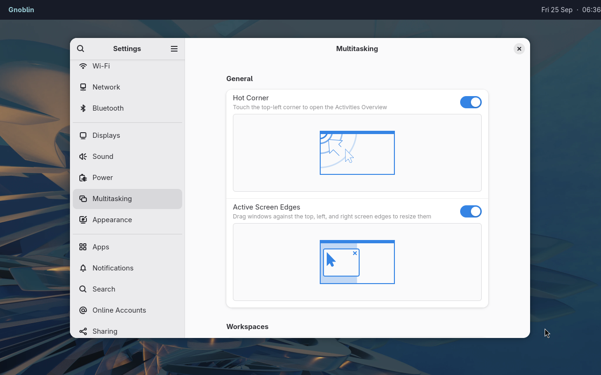

# gnoblin.configure.shell

Configure this part of `gnoblin.configure` with the `shell` key.

Put these fields inside `gnoblin.configure {shell = {...}}`. Changes apply on
configuration reload unless the row says the preference is persisted.

| Key                     | Values                                                                   | Default                                   |
| ----------------------- | ------------------------------------------------------------------------ | ----------------------------------------- |
| `minimize_animation`    | `"zoom"`, `"fade"`, `"none"`, `"gnome"`                                  | `"zoom"`                                  |
| `minimize_duration`     | 0–5000 ms                                                                | `200`                                     |
| `minimize_target`       | `[x, y]`, two integers from −1,000,000 to 1,000,000                      | Dock target, then bottom centre           |
| `layer_animation`       | `"slide"`, `"fade"`, `"none"`                                            | `"slide"`                                 |
| `layer_duration`        | 0–5000 ms                                                                | `220`                                     |
| `layer_easing`          | `"linear"`, `"ease-out-quad"`, `"ease-out-cubic"`, `"ease-in-out-cubic"` | `"ease-out-cubic"`                        |
| `window_menu`           | Up to 32 command strings; first must be non-empty if present             | Empty                                     |
| `window_switcher`       | Boolean                                                                  | `false`                                   |
| `notifications`         | Boolean                                                                  | Initially disabled; persists in GSettings |
| `input_source_switcher` | Boolean                                                                  | Initially disabled; persists in GSettings |
| `wallpaper`             | Boolean                                                                  | `true`; persists in GSettings             |

`minimize_animation` and `layer_animation` select a built-in name or a map of
event names to custom animation names. Their accepted values and motion are
described in the [animation guide](/guides/animations). `minimize_target` is a
two-integer `[x, y]` position in logical desktop pixels; omitted coordinates use
the dock target or bottom-center fallback. For example, `minimize_target = {320, 400}`.

Use `window_menu = gnoblin.array {}` to explicitly clear a configured menu command.



_Waybar is a separate desktop client; Gnoblin's shell settings control compositor behavior._

Notification and input-source preferences persist in GSettings. With no usable
picture configured, GNOME displays its configured background color.

Guides: [animations](/guides/animations), [native features](/guides/session_settings),
[wallpapers](/guides/wallpapers), [window menu](/guides/window_menu).

## Type definition

This is schema pseudocode in Lua table form. `?` marks optional settings;
`|` separates accepted alternatives.

```lua
gnoblin.configure {
    shell = {
        minimize_animation = string | {minimize = string?, restore = string?}?,
        minimize_duration = integer?, -- 0–5000 ms
        minimize_target = {integer, integer}?, -- each −1,000,000 to 1,000,000
        layer_animation = string | {
            ["layer-open"] = string?, ["layer-close"] = string?,
            ["in"] = string?, out = string?,
        }?,
        layer_duration = integer?, -- 0–5000 ms
        layer_easing = "linear" | "ease-out-quad" | "ease-out-cubic" | "ease-in-out-cubic"?,
        window_menu = {string, ...} | {}?, -- at most 32; first argument nonempty
        window_switcher = boolean?,
        notifications = boolean?,
        input_source_switcher = boolean?,
        wallpaper = boolean?,
    },
}
```
