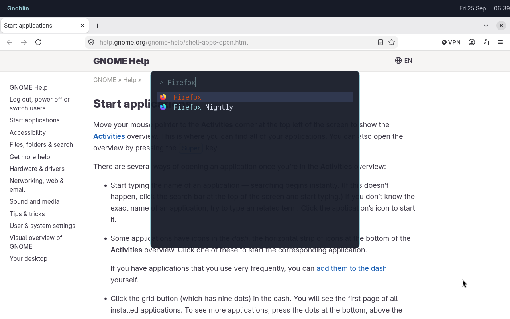

# gnoblin.configure.shortcuts

Define and edit command shortcuts, including media keys, by name. Entries merge with the same name; fields you omit keep their previous values. Set `enable = false` to disable an imported shortcut.

```lua
gnoblin.configure {
    shortcuts = {
        terminal = {
            binding = "<Super>Return",
            command = {"ptyxis", "--new-window"},
        },
    },
}
```

See the [shortcuts guide](/guides/shortcuts) for key names, conflicts and command behavior.



_A Gnoblin shortcut opens Fuzzel; the launcher filters to Firefox._

## Run a built-in action

An `action` names an existing GNOME keybinding as `group.key`. Accepted
namespaces are `gnome:shell`, `wm`, `mutter`, and `wayland`. Each maps to a
GSettings schema, and the key must exist in that schema on your GNOME version.

Run `gsettings list-keys SCHEMA` to discover keys. Run
`gsettings describe SCHEMA KEY` to read one key's purpose.

| Field     | Accepted values                                                     | Meaning                                                                       |
| --------- | ------------------------------------------------------------------- | ----------------------------------------------------------------------------- |
| `action`  | `"gnome:shell.KEY"`, `"wm.KEY"`, `"mutter.KEY"`, or `"wayland.KEY"` | Selects a built-in action from that schema. Use underscores in Lua key names. |
| `binding` | GTK accelerator string for a command; array for an action           | Required. An empty action list disables its current binding.                  |
| `command` | Nonempty array of strings                                           | Alternative to `action`; runs the program directly without shell expansion.   |

Set exactly one of `action` or `command`:

```lua
gnoblin.configure {
    shortcuts = {
        close_window = {
            action = "wm.close",
            binding = {"<Super>q"},
        },
    },
}
```

This binds Mutter's `close` action. GNOME's [Gio.Settings reference](https://docs.gtk.org/gio/class.Settings.html)
explains schema-backed settings; Gnoblin's
[keybinding reference](/config/configure/keybindings) lists all groups and
shows how to find keys on your system.

The named view lets later files inspect and edit imported shortcuts. Each
entry exposes public `snake_case` fields. `pairs` visits the names already
loaded:

```lua
for name, shortcut in pairs(gnoblin.configure.shortcuts) do
    print(name, shortcut.binding or "built-in action")
end
```

The bundled config supplies these names:

| Keys       | Shortcut names                                               |
| ---------- | ------------------------------------------------------------ |
| Volume     | `volume-up`, `volume-down`, `volume-mute`, `microphone-mute` |
| Brightness | `brightness-up`, `brightness-down`                           |
| Playback   | `media-play-pause`, `media-next`, `media-previous`           |
| Files      | `files`                                                      |

To disable one after loading the bundled config:

```lua
gnoblin.configure.shortcuts["volume-up"].enable = false
```

## Type definition

Every named entry uses exactly one of `command` or `action`. `?` marks
optional fields; `|` separates alternatives.

```lua
gnoblin.configure {
    shortcuts = {
        ["shortcut-name"] = {
            binding = string | {string, ...} | {},
            command = {string, ...}?,
            action = string | {schema = string, key = string}?,
            trigger = "press" | "release"?,
            capture_input = boolean?,
            enable = boolean?,
        }, ...,
    },
}
```
