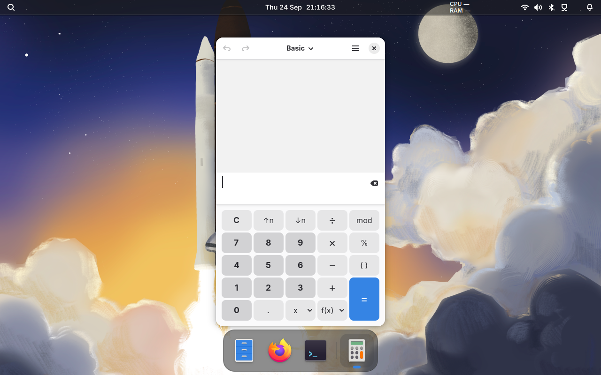

# Try Gnoblin in a window

The devkit runs a nested Gnoblin session inside your Wayland desktop.
Use it to test a build without logging out.

First complete the [source build](install-source.md).

## Start

From the checkout:

```sh
GNOBLIN_PREFIX="$PWD/install" just preview
```

A desktop viewer and terminal open. Programs started from that terminal connect
to the nested compositor.



_This capture shows Gnoblin managing the application window while Bingux,
which is a separate project, provides the visible desktop shell._

To choose a terminal explicitly:

```sh
GNOBLIN_PREFIX="$PWD/install" just preview kitty
```

## Try your shell

From the devkit terminal, launch an installed layer-shell client:

```sh
waybar
```

The bar should appear inside the viewer. Try its menus and launcher.
Close the terminal to stop the devkit.

## Options

| Variable                   | Accepted values          | Default    | Purpose                                                           |
| -------------------------- | ------------------------ | ---------- | ----------------------------------------------------------------- |
| `MONITOR`                  | `WIDTHxHEIGHT` in pixels | `1600x900` | Sets the nested display size.                                     |
| `GNOME_DEVKIT_HEADLESS`    | `0` or `1`               | `0`        | `1` starts without a viewer; `0` requires a host Wayland display. |
| `GNOME_DEVKIT_EXEC`        | Shell command string     | Unset      | Runs the string with `bash -c` instead of opening a terminal.     |
| `GNOME_DEVKIT_UNSAFE_MODE` | `0` or `1`               | `0`        | `1` enables privileged shell D-Bus APIs for tests.                |

## Headless / scripting mode

```sh
GNOME_DEVKIT_HEADLESS=1 \
GNOME_DEVKIT_EXEC='gnoblinctl feature list --json' \
GNOBLIN_PREFIX="$PWD/install" just preview
```

This runs without a host Wayland display and exits after the command.
`just test-preview` checks this environment.

## Isolation

The nested display and D-Bus bus are separate. Host X11, accessibility and gvfs
connections are not passed through.

**Your HOME and runtime directory remain real.** Applications can still read
or change your files and configuration. This is not a security sandbox.

For a fresh profile, including screenshots and demos, run:

```sh
bash scripts/run-clean-devkit.sh
```

This creates disposable home, config, data, cache, state and runtime directories
and removes them when the devkit closes. The viewer still connects to your host
Wayland session and may use its PipeWire socket. Use a VM when the guest must be
fully separate from host services. Check the image before publishing it.

### Documentation captures

The checked-in documentation scenes can be recaptured with:

```sh
scripts/capture-doc-examples.sh desktop
```

The script builds a fresh profile, starts Waybar and Files, then writes
`docs/images/gnoblin-build-a-desktop.png`. Pass a second argument for another
output directory. It needs a visible Wayland session, a current Gnoblin build
in `./install`, `grim` and the desktop apps configured by the script. The
session build installs Adwaita Hyprcursor into `./install`.

The [private test harness](testing.md) is for automated checks.
A devkit run does not verify the installed login session.

## Troubleshooting

| Problem                    | Next step                                                |
| -------------------------- | -------------------------------------------------------- |
| No host `WAYLAND_DISPLAY`  | Use a Wayland desktop or headless mode                   |
| No Shell in `./install`    | Finish the source build                                  |
| No terminal found          | Install one or pass its command explicitly               |
| Quickshell/Qt mismatch     | Install or rebuild a matching Quickshell                 |
| `EBUSY` taking the session | Use this devkit launcher, not a direct native/KMS launch |
