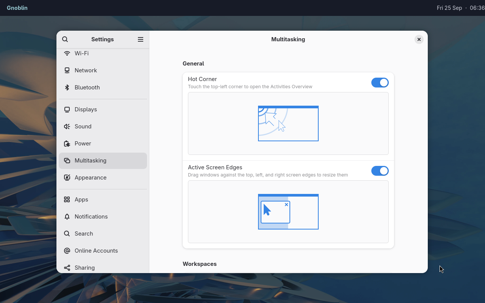

# Try Gnoblin in a window

The devkit runs a nested Gnoblin session inside your Wayland desktop.
Use it to test a build without logging out.
The normal source build omits the viewer; the first preview builds it for you.

First complete the [source build](install-source.md).

## Start

From the extracted source tarball or a checkout:

```sh
./build.sh --preview
```

A desktop viewer and terminal open. Programs started from that terminal connect
to the nested compositor. The devkit provides a 1280×720 output inside the
viewer.

With the default config, that output is empty until you start a client. Gnoblin
provides the compositor, not a built-in panel, launcher, or desktop shell. The
terminal is a separate window on your host desktop.

If Waybar is installed, start it automatically with the preview:

```sh
GNOBLIN_DEVKIT_EXEC='waybar' ./build.sh --preview
```



_The nested session can run a separate bar and stock desktop applications._

To choose a terminal explicitly:

```sh
./build.sh --preview --terminal kitty
```

## Try your shell

From the host terminal opened by the devkit, launch an installed shell or
layer-shell client:

```sh
waybar
```

The bar should appear inside the viewer. Try its menus and launcher.
Close the terminal to stop the devkit.

## Options

| Variable                       | Accepted values      | Default | Purpose                                                                |
| ------------------------------ | -------------------- | ------- | ---------------------------------------------------------------------- |
| `GNOBLIN_DEVKIT_EXEC`          | Shell command string | Unset   | Runs the command with `bash -c` instead of opening a terminal.         |
| `GNOBLIN_DEVKIT_CONFIG_SOURCE` | Directory path       | Unset   | Copies this config tree into the devkit's disposable config directory. |

## Run a command

```sh
GNOBLIN_DEVKIT_EXEC='gnoblinctl version' \
./build.sh --preview
```

The command runs inside the nested Gnoblin session. A host Wayland display is
required to show the viewer; close the viewer to stop the session.

## Isolation

The nested display and D-Bus bus are separate. The devkit uses disposable home
and XDG directories, and exposes the host PipeWire socket when available.

Applications launched inside the devkit can still access host services and
files available to your user. This is not a security sandbox.

For a fresh profile, including screenshots and demos, run:

```sh
bash scripts/run-clean-devkit.sh
```

This creates disposable home, config, data, cache, state and runtime directories
and removes them when the devkit closes. The viewer still connects to your host
Wayland session and may use its PipeWire socket. Use a VM when the guest must be
fully separate from host services. Check the image before publishing it.

### Documentation captures

The checked-in documentation scenes can be recaptured with:

```sh
scripts/capture-doc-examples.sh site-firefox
scripts/capture-doc-examples.sh waybar-firefox
scripts/capture-doc-examples.sh waybar-launcher
scripts/capture-doc-examples.sh waybar-settings
scripts/capture-doc-examples.sh waybar-quickshell-dock
scripts/capture-doc-examples.sh quickshell-firefox
scripts/capture-doc-examples.sh quickshell-files
scripts/capture-doc-examples.sh window-effects
GNOBLIN_DOC_BINGUX_PATH=../bingux/shell/bingux scripts/capture-doc-examples.sh bingux-firefox
GNOBLIN_DOC_BINGUX_PATH=../bingux/shell/bingux scripts/capture-doc-examples.sh bingux-files
```

Each scene gets a disposable home and XDG profile. Firefox has its own clean
profile; `site-firefox` opens the configuration reference. Other Firefox scenes
open `www.gnoblin.org` by default. Captures set dark appearance in a disposable
DConf database.

Choose Bingux, Waybar with Mako or Quickshell for the visible shell. Bingux
scenes load its packaged Gnoblin defaults and use neutral shell preferences.
Captures include the pointer and omit terminal windows.

Set `GNOBLIN_DOC_SITE_URL` or `GNOBLIN_DOC_FIREFOX_URL` to choose another page.
Pass a second argument for a different output directory. Captures need a visible
Wayland session, a current build in `./install` and the apps used by the scene. See the
[shell guide](/bring-your-own-shell) for the resulting setups.

The [private test harness](testing.md) is for automated checks.
A devkit capture shows the nested session, not an installed login session.

## Troubleshooting

| Problem                    | Next step                                                |
| -------------------------- | -------------------------------------------------------- |
| No host `WAYLAND_DISPLAY`  | Start the preview from a Wayland desktop                 |
| No Gnoblin in `./install`  | Finish the source build                                  |
| No terminal found          | Install one or pass its command explicitly               |
| Quickshell/Qt mismatch     | Install or rebuild a matching Quickshell                 |
| `EBUSY` taking the session | Use this devkit launcher, not a direct native/KMS launch |
