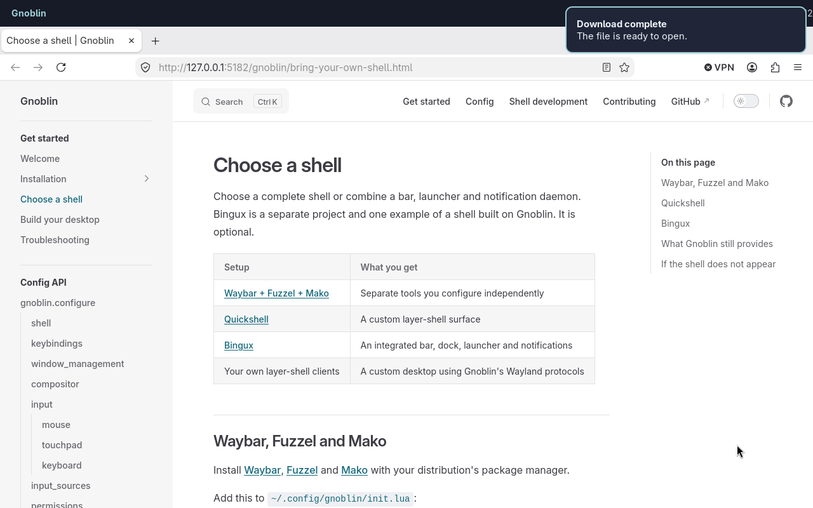

# Autostart

[Configuration reference](/config/configure/autostart)

Use `autostart` for commands that should start in your session. Add this to
`~/.config/gnoblin/init.lua`:

```lua
gnoblin.configure {
    autostart = {
        waybar = {command = {"waybar"}},
    },
}
```

Install the program first. Gnoblin runs the command directly, without shell
expansion; use one string for each argument. If you need pipes or redirection,
explicitly run a shell.

A new entry starts when the config reloads. The optional `when` field defaults
to `"on_login"`, currently the only supported trigger. A command that was
already launched uses its updated arguments at the next login.

Do not add a program already started by a service, such as Bingux.

## Override an imported command

Use the same name to change its arguments:

```lua
gnoblin.configure {
    autostart = {
        waybar = {
            command = {"waybar", "--config", "/home/you/.config/waybar/work.jsonc"},
        },
    },
}
```

Replace the path with your own. Omitted fields keep their earlier values.

## Disable an entry

Set `enable = false` on the named entry to prevent it starting in future
sessions:

```lua
gnoblin.configure {
    autostart = {
        waybar = {enable = false},
    },
}
```

An unknown name adds a disabled entry. Disabling or removing an entry does not
stop a process that is already running.

## When does it run?

- A new name starts when the config reloads.
- Each name gets one launch per login. Saving again or unlocking does not
  start a second copy.
- Changing the command for an entry that already launched takes effect at the
  next login.
- Disabling or removing an entry does not stop its running process.



_A notification daemon such as Mako runs as a separate autostarted client._

See [command syntax](/guides/shortcuts#commands-and-shell-syntax) for shell
commands and [configuration loading](/guides/files_and_load_order) for how
named entries combine across files.
