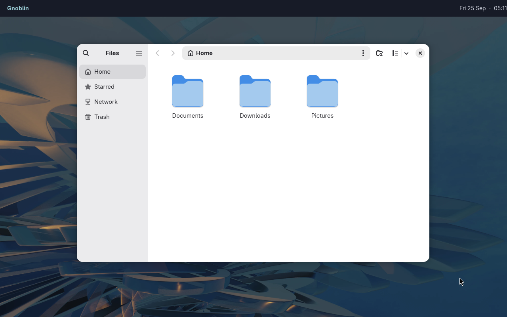

# cursors

[Configuration reference](/config/configure)

Set the compositor cursor theme and size in `~/.config/gnoblin/init.lua`.
Gnoblin currently renders these settings with Hyprcursor.

Set these fields in `gnoblin.configure`:

- `cursor.theme` — Installed Hyprcursor theme name. The default is
  `Adwaita-Hyprcursor`.
- `cursor.size` — Integer from `1` to `256` logical pixels. The default is `24`.

Omitted fields use their defaults.

## Select a theme

Install a cursor theme, then replace `ThemeName` below with its installed
theme name:

```lua
gnoblin.configure {
    cursor = {
        theme = "ThemeName",
        size = 24,
    },
}
```

Changes apply after saving; run `gnoblinctl config reload` to apply them now.
To select the Adwaita artwork theme:

```lua
gnoblin.configure {cursor = {theme = "Adwaita-Hyprcursor", size = 24}}
```



## Hyprcursor support

Gnoblin loads compositor cursor themes through Hyprcursor. The upstream
[theme guide](https://github.com/hyprwm/hyprcursor/blob/main/docs/MAKING_THEMES.md)
describes theme files and cursor metadata.

Install a compiled theme in `~/.local/share/icons/<theme>/` or
`~/.icons/<theme>/`, then set `cursor.theme` to its installed name. The theme
and size apply to compositor cursors and the launch wait cursor. Animated
frames retain their hotspots and timing.

Client applications that supply their own cursor surfaces continue to draw
those surfaces themselves. Gnoblin does not look up Xcursor theme files as a
fallback.

## Adwaita-Hyprcursor

Gnoblin installs Adwaita-Hyprcursor with the session package and source
installation. Select it directly in `init.lua`; no separate theme install is
needed. The theme includes GNOME Adwaita SVG artwork, animation, Xcursor
fallbacks and the required licences. The source artwork is in
`src/cursor/adwaita/`.

## Build support and tests

Mutter needs Hyprcursor 0.1.13+ and `-Dhyprcursor=enabled`.
Nix enables it; local Meson builds detect the development package.

Run `tests/test-adwaita-artwork.py` and `tests/test-adwaita-hyprcursor.py`
for artwork checks. They also need Pillow and `rsvg-convert`.

For native testing, run `tests/test-hyprcursor.py` and
`tests/test-launch-feedback.py` through the [private test harness](/testing).
They cover sizes, hotspots, timing, missing shapes and launch cursor restoration.
