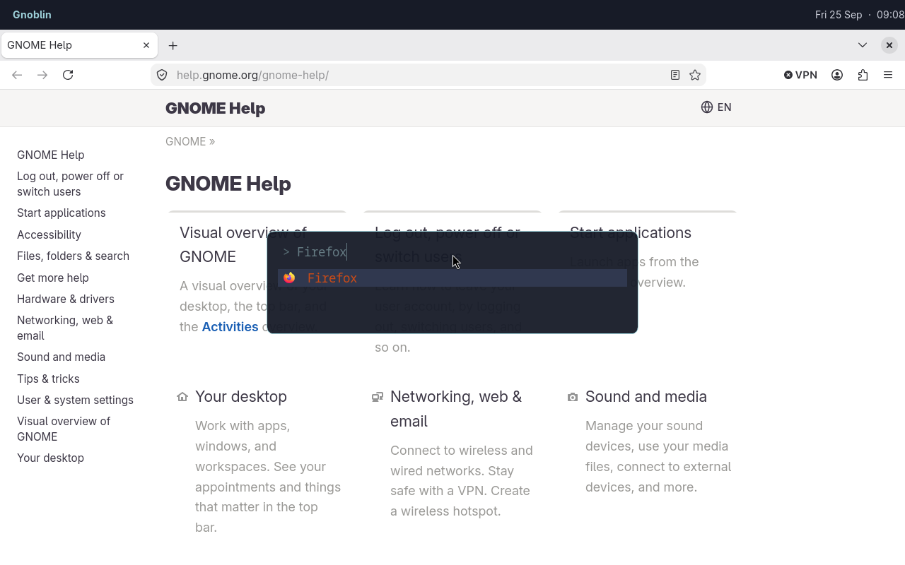

# shortcuts

[Configuration reference](/config/configure)

Gnoblin reads global shortcuts from its Lua config. Use
`gnoblin.configure.shortcuts` to run commands and
`gnoblin.configure.keybindings` to change built-in Mutter actions. Add the
examples to `~/.config/gnoblin/init.lua`; changes apply when the config reloads.

## Launch a command

Add this after any `gnoblin.load(...)` lines. It opens a terminal with Super+Enter:

```lua
gnoblin.configure {
    shortcuts = {
        my_terminal = {
            binding = "<Super>Return",
            command = {"ptyxis", "--new-window"},
        },
    },
}
```

Replace `ptyxis` with an installed terminal. Each command argument is a separate
string. Spaces inside a string stay in that argument.

Shortcut names use letters, numbers, `_` and `-`. A config can declare up to
256 shortcuts. Removing a command shortcut releases its binding; it does not
stop a launched program.

The standalone session accepts command shortcuts and Mutter actions at startup,
including release triggers and bare Super. It does not provide GNOME Shell
actions or popup input capture. Restart the compositor after changing its
config.

## Open an application launcher

Bind Fuzzel to Super+D:

```lua
gnoblin.configure {
    shortcuts = {
        launcher = {binding = "<Super>d", command = {"fuzzel"}},
    },
}
```



_The shortcut opens Fuzzel; Firefox is the selected search result._

## Remove a shortcut

Set `enable = false` to disable a named shortcut added by another config file:

```lua
gnoblin.configure {
    shortcuts = {
        my_terminal = {enable = false},
    },
}
```

The config is rebuilt on every reload. Disabling a command shortcut releases
its binding. Shortcuts registered by other programs are unaffected.

Put the removal after the file that adds the shortcut. See
[load order](/guides/files_and_load_order#override-or-append).

## Key names

| Binding             | Keys                                         |
| ------------------- | -------------------------------------------- |
| `"<Super>Return"`   | Super + Enter                                |
| `"<Super><Shift>q"` | Super + Shift + Q                            |
| `"<Alt>F8"`         | Alt + F8                                     |
| `"Super"`           | Super press and release, without another key |

Super is usually the Windows-logo key. Put modifiers in angle brackets and
the main key after them. This is
[GTK accelerator syntax](https://docs.gtk.org/gtk4/func.accelerator_parse.html).

Run `gnoblinctl shortcut capture` in a Gnoblin terminal and press a key combination. It prints the GTK accelerator for `binding`; bare Super prints Gnoblin’s special `Super` binding. Escape cancels. The command grabs the keyboard while it waits, consumes the captured combination, and times out after 30 seconds by default. Use `--timeout SECONDS` for 1–60 seconds.

Held keys do not repeatedly launch commands. Command shortcuts are inactive on
the lock and login screens.

## Change a built-in action

```lua
gnoblin.configure {
    keybindings = {
        wm = {close = {"<Super>q"}},
    },
}
```

Built-in actions accept a list of accelerator strings. Use an empty list to
disable one. The group must be `wm`, `mutter`, or `wayland`; each group maps to
a Mutter GSettings keybinding schema. The action names and defaults depend on
your installed desktop schemas; Gnoblin does not define a fixed list for every
version.

Find the schema and action names on your system with
`gsettings list-schemas` and `gsettings list-keys SCHEMA`. Run
`gsettings describe SCHEMA KEY` to read an action's description. The
[keybinding reference](/config/configure/keybindings) lists the three supported
Mutter groups and gives examples.

Desktop Settings edits do not change Gnoblin's active bindings. Removing an
override restores the default on reload.

## Media keys

Media keys use command shortcuts. The starter config includes volume and
microphone mute through WirePlumber's `wpctl`, and playback through
`playerctl`. Install those commands if you use the matching keys. Brightness
keys are not handled by the standalone session; bind them to a command such as
`brightnessctl` if your hardware and permissions support it.

Run `gnoblinctl config path` to see the config file used by your session. Run
`gnoblinctl config default` to print the packaged starter config. For example,
a volume key can run `wpctl` directly:

```lua
gnoblin.configure {
    shortcuts = {
        ["volume-up"] = {
            binding = "XF86AudioRaiseVolume",
            command = {"wpctl", "set-volume", "@DEFAULT_AUDIO_SINK@", "5%+"},
        },
    },
}
```

Edit or remove these entries in your Lua config to change the media-key
behavior. The commands they call must be installed.

## Avoid conflicts

To override an imported shortcut, use the same map key. Only supplied fields
change. Different names must use different bindings. See the
[override example](/recipes/add-a-shortcut).

A Mutter action may already use the key. Change or disable it through
`gnoblin.configure.keybindings` before assigning the same key to a command.
Gnoblin rejects duplicate bindings in the config and keeps the previous
working registrations if a reload contains an invalid or conflicting shortcut.

## Commands and shell syntax

Commands run directly. `$HOME`, `~`, pipes and redirection are not expanded.
Use an absolute path, a program on PATH, or explicitly run a shell:

```lua
gnoblin.configure {
    shortcuts = {
        ["log-time"] = {
            binding = "<Super><Shift>t",
            command = {"sh", "-c", "date >> \"$HOME/shortcut.log\""},
        },
    },
}
```

This appends the current time to `~/shortcut.log` when you press Super+Shift+T.

## Popups that capture typing

For a shell popup that needs the keys typed after bare Super, use the runtime
`gnoblin.shortcuts.bind` API with `capture_input = true`. This is a runtime
binding, not a `gnoblin.configure.shortcuts` option. See
[shortcut state and capture](/config/runtime-api#shortcut-state-and-capture)
for the binding contract and events.

See also [restore-or-minimise bindings](/guides/window_state_shortcuts).
