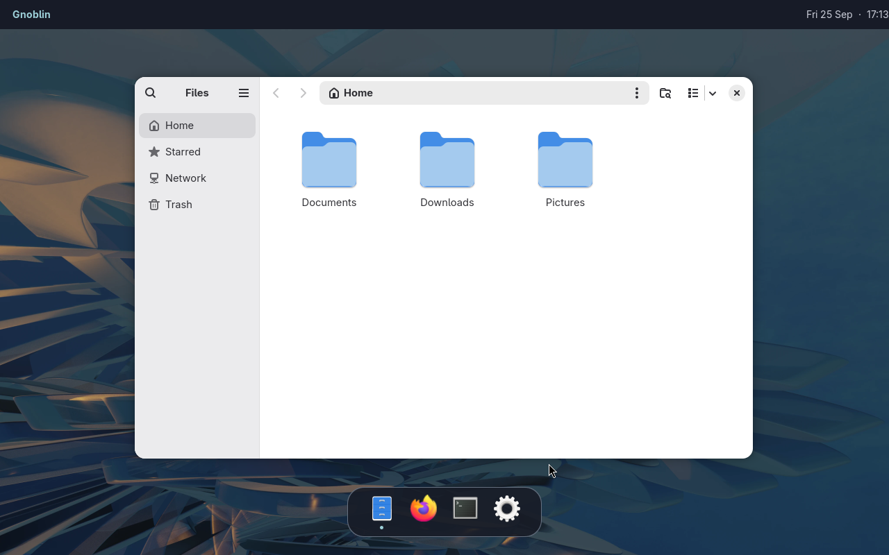

# Gnoblin

Gnoblin is a Wayland desktop built on Mutter and a fork of GNOME Shell, with
layer-shell support. Build your own shell or try Bingux, one separate project
that uses Gnoblin.

_Bingux is one separate shell project that uses Gnoblin. Its packaged rules round the Files window, fill its CSD corner gaps and draw the window shadow._

_Waybar provides the top bar; [Quickshell](/bring-your-own-shell#quickshell) provides the dock._

The [configuration API](/config) links each setting to a detailed reference.

## Get started

- [Install Gnoblin](/installation)
- [Choose a shell](/bring-your-own-shell)
- [Build a desktop](/build-a-desktop)

## Configure

- [Configuration API](/config)
- [Configuration recipes](/recipes/)
- [Configuration guides](/guides/window_rules)

## Develop

- [Shell integration](/shell-integration)
- [Compositor bridge](/compositor-bridge)
- [Wayland protocols](/wayland-protocols)

## Help

- [Troubleshooting](/troubleshooting)
