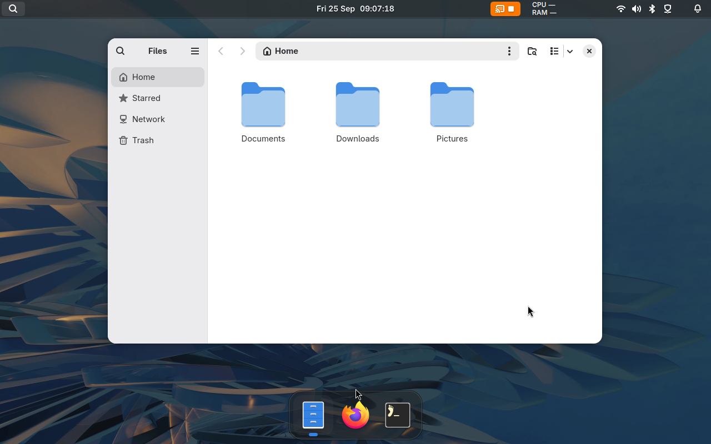

# Integrate a desktop shell

These APIs are for shell authors. Desktop configuration starts with
[the configuration guide](/config).

## Dock animation targets

A dock can tell Gnoblin where each window's icon appears.
Minimise and restore animations then use that rectangle.

With Quickshell, call
[Toplevel.setRectangle](https://quickshell.org/docs/types/Quickshell.Wayland/Toplevel/)
using coordinates relative to the dock's PanelWindow:

```javascript
function updateTarget(toplevel) {
    const point = icon.mapToItem(dock.contentItem, 0, 0);
    toplevel.setRectangle(dock, Qt.rect(point.x, point.y, icon.width, icon.height));
}
```

Update after layout changes and when a window joins a group.
Give each grouped window the same icon rectangle before minimising it.

A zero-size rectangle clears the hint. The hint also clears when its surface
or window handle disappears.



_Bingux is one separate shell project using Gnoblin; its dock can provide icon targets._

## Layer placement and animation

During entry and exit animations, Gnoblin moves the displayed panel without
asking the client to resize its buffer. Space reserved for the panel (its
exclusive zone) stays unchanged, and it remains on the same monitor.

When a panel changes size, Gnoblin keeps its previous buffer aligned to its chosen
edge until the client submits the new buffer. The client must still set its
Wayland anchors and margins correctly.

Use a namespace rule with `animation = "none"` when the client owns its
whole-surface transition. See [animations](/guides/animations).

## Input and window control

Choose a window interface based on what the shell needs:

| Interface                                                  | Use it for                           | Data and limits                                                                                                                                                                       |
| ---------------------------------------------------------- | ------------------------------------ | ------------------------------------------------------------------------------------------------------------------------------------------------------------------------------------- |
| [`ext_foreign_toplevel_list_v1`](wayland-protocols.md)     | A portable, read-only window list    | Mapped windows, identifier, title and app ID. The identifier lasts only while the window is mapped; no active state or control requests.                                              |
| [`zwlr_foreign_toplevel_manager_v1`](wayland-protocols.md) | A protocol-based taskbar or switcher | Title, app ID and state; requests for activation, close, minimize, maximize and fullscreen. Check state events for results. Gnoblin omits optional `output_enter` and `output_leave`. |
| [Compositor bridge](compositor-bridge.md)                  | A Gnoblin-specific shell             | Live window snapshots, actions, previews, workspaces and input sessions over Gnoblin's runtime socket.                                                                                |

See the [Wayland protocol catalogue](wayland-protocols.md) for advertised globals
and versions. For persistent keybindings, use the [Lua shortcut config](/config/configure/shortcuts).
Use the [window-menu contract](/guides/window_menu#write-a-handler) for titlebar
menus and the [snapping contract](/guides/window_snapping#shell-integration) for
layout pickers.
