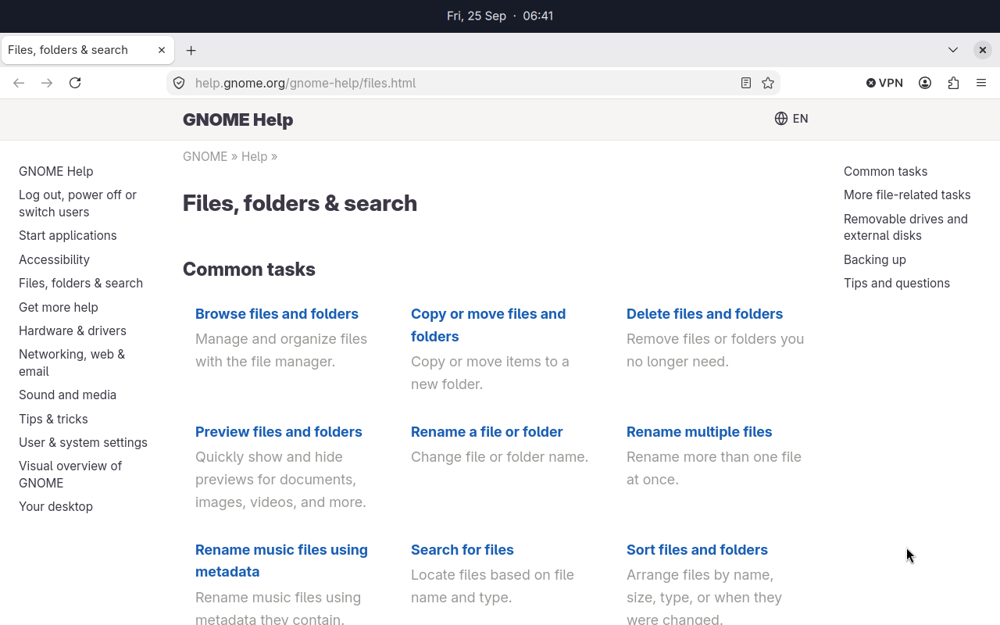
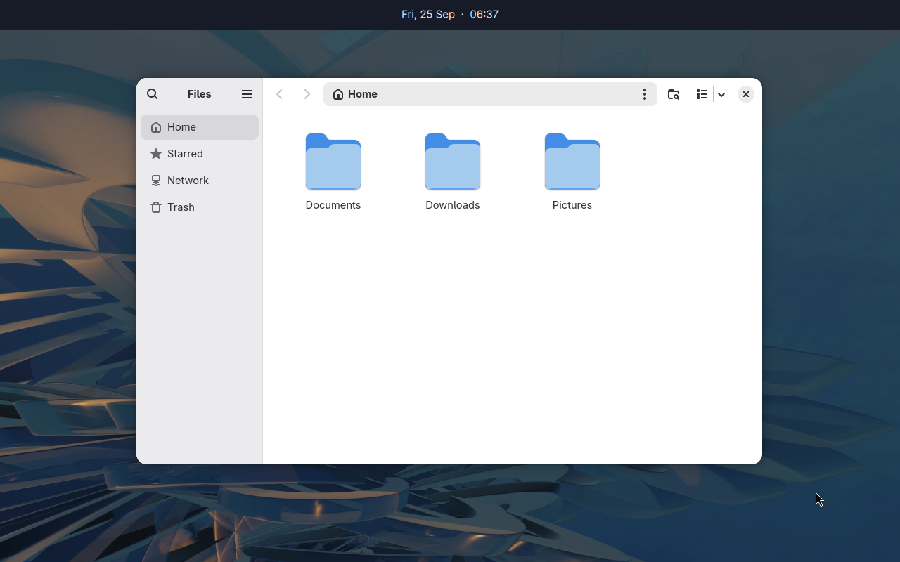

# Wayland protocol catalog

This page covers the additional protocol globals Gnoblin registers or gates
in a Gnoblin session. It does not list every core Wayland or upstream Mutter
global. A client must bind the interface advertised by the running compositor;
vendored XML alone does not mean a protocol is available.

## Configure availability

Gnoblin enables the listed interfaces by default in its own session. Disable
one in `init.lua` with its Lua key:

```lua
gnoblin.configure {
    protocols = {
        wlr_screencopy = false,
    },
}
```

Lua underscores become hyphens in the native setting name. Protocol globals
are registered at compositor startup, so **log out and back in** after changing
these gates. `gnoblinctl config reload` cannot add or remove an advertised
global. GNOME's separate login session does not advertise Gnoblin-owned
globals.

## Available interfaces

| Lua key                           | Advertised interface                                                                                            | Use it for                                           | Guide                                        |
| --------------------------------- | --------------------------------------------------------------------------------------------------------------- | ---------------------------------------------------- | -------------------------------------------- |
| `wlr_layer_shell`                 | [`zwlr_layer_shell_v1`](https://github.com/swaywm/wlroots/blob/master/protocol/wlr-layer-shell-unstable-v1.xml) | Bars, docks, launchers, overlays and exclusive zones | [Choose a shell](bring-your-own-shell.md)    |
| `wlr_screencopy`                  | `zwlr_screencopy_manager_v1`                                                                                    | Native output capture                                | [Permissions](/guides/permissions)           |
| `ext_foreign_toplevel_list`       | `ext_foreign_toplevel_list_v1`                                                                                  | Enumerate toplevel windows                           | [Shell integration](shell-integration.md)    |
| `wlr_foreign_toplevel_management` | `zwlr_foreign_toplevel_manager_v1`                                                                              | Inspect and control windows                          | [Shell integration](shell-integration.md)    |
| `ext_data_control`                | `ext_data_control_manager_v1`                                                                                   | Clipboard managers                                   | [Session settings](/guides/session_settings) |
| `ext_idle_notify`                 | `ext_idle_notifier_v1`                                                                                          | Idle notifications                                   | [Session settings](/guides/session_settings) |
| `wlr_gamma_control`               | `zwlr_gamma_control_manager_v1`                                                                                 | Per-output gamma                                     | [Session settings](/guides/session_settings) |
| `wlr_output_power_management`     | `zwlr_output_power_manager_v1`                                                                                  | Output power state                                   | [Session settings](/guides/session_settings) |
| `ext_background_effect_v1`        | `ext_background_effect_manager_v1`                                                                              | Client-defined background blur regions               | [Background blur](background-effects.md)     |
| `xdg_decoration`                  | `zxdg_decoration_manager_v1`                                                                                    | Negotiate client or server titlebars                 | [Window frames](/guides/window_frames)       |
| `window_frame_renderer`           | `gnoblin_window_frame_manager_v1`                                                                               | External frame renderer service                      | [Frame renderer API](frame-renderer-api.md)  |
| `blur_fade`                       | `gnoblin_blur_fade_manager_v1`                                                                                  | Per-item blur fade metadata                          | [Blur fades](blur-fades.md)                  |
| `ext_session_lock`                | `ext_session_lock_manager_v1`                                                                                   | Session locking for third-party lockers              | [Session locking](session-lock.md)           |

Bind a version no higher than the one the compositor advertises. For
Gnoblin-owned protocols, the XML under `src/protocols/` is the wire-level
reference.

For standard protocol requests, events and enum values, see the
[Wayland protocol documentation](https://wayland.freedesktop.org/docs/book/)
and the [wayland-protocols source](https://gitlab.freedesktop.org/wayland/wayland-protocols).
This catalog identifies the interface to use and where to find its details.

For example, a layer-shell client controls its anchors, keyboard interactivity
and exclusive zone. Gnoblin then places the surface and applies any matching
`type = "layer"` [window rules](/guides/window_rules). A panel that animates its own
whole surface can disable the compositor's layer animation for its namespace.



_Quickshell positions the panel with layer shell._



_The same layer-shell surface sits above an ordinary application window._

Screen capture through `wlr_screencopy` is separate from capture through the
desktop portal. The latter follows [portal permission policy](/guides/permissions).
Turning off this global is not a blanket screen-sharing policy.

## Interface not yet available

`zwlr_output_manager_v1` has vendored XML but is not registered as a supported
Gnoblin global. Display configuration is available through Gnoblin's existing
interfaces. Session locking is supported through `ext_session_lock_manager_v1`;
see [Session locking](session-lock.md) for locker requirements and security
behavior.

## Inspect a running session

This catalog follows current Gnoblin source; older installed builds may
advertise fewer globals.

Check `gnoblinctl version --json` and the running registry when packaging or
debugging. Run `wayland-info` inside the Gnoblin session or devkit so it uses the
right `WAYLAND_DISPLAY`. A checkout or XML file cannot prove which globals a
login session advertised.
